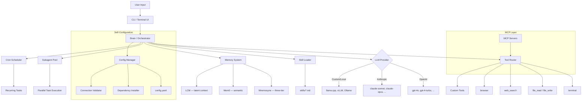

<p align="center">
  <pre>
  ╔══════════════════════════════════════════════════════════════╗
  ║                                                              ║
  ║    ███████╗███╗   ██╗███████╗    ██╗   ██╗██╗   ██╗          ║
  ║    ██╔════╝████╗  ██║██╔════╝    ██║   ██║╚██╗ ██╔╝          ║
  ║    ███████╗██╔██╗ ██║███████╗    ██║   ██║ ╚████╔╝           ║
  ║    ╚════██║██║╚██╗██║╚════██║    ╚██╗ ██╔╝  ╚██╔╝           ║
  ║    ███████║██║ ╚████║███████║     ╚████╔╝    ██║             ║
  ║    ╚══════╝╚═╝  ╚═══╝╚══════╝      ╚═══╝     ╚═╝             ║
  ║                                                              ║
  ║            A G E N T                                         ║
  ║                                                              ║
  ║    Configure your agent by talking to it.                    ║
  ║                                                              ║
  ╚══════════════════════════════════════════════════════════════╝
  </pre>
</p>

<p align="center">
  <strong>The personal AI agent that configures itself through conversation.</strong>
</p>

<p align="center">
  <a href="./LICENSE"></a>
  
  = 20">
  
  <a href="#-quick-start"></a>
</p>

---

**SNS MyAgent** is a personal, single-user AI agent that **configures itself through conversation**. Tell it what you need — it installs, configures, and wires everything for you.

No YAML editing. No config file archaeology. No setup guides.

> *"Add MCP filesystem"* → agent installs the MCP server, writes config, verifies it works.
>
> *"Setup memory pakai Mnemosyne"* → agent initializes the three-tier memory system, creates the database, confirms.
>
> *"Switch to Claude"* → agent reconfigures provider, validates API key, ready.

Forked from [Hermes Agent](https://github.com/NousResearch/hermes-agent) by [Nous Research](https://nousresearch.com), stripped to a focused, local-first, single-user terminal agent.

---

## Table of Contents

- [Why SNS MyAgent?](#-why-sns-myagent)
- [Competitive Landscape](#-competitive-landscape)
- [Conversational Configuration](#-conversational-configuration)
- [Architecture](#-architecture)
- [Token Budget Manager (TBM)](#token-budget-manager-tbm)
- [Requirements](#-requirements)
- [Installation](#-installation)
- [Quick Start](#-quick-start)
- [Configuration Reference](#-configuration-reference)
- [CLI Reference](#-cli-reference)
- [Tools](#-tools)
- [Skills](#-skills)
- [Memory System](#-memory-system)
- [MCP Integration](#-mcp-integration)
- [Development](#-development)
- [Troubleshooting](#-troubleshooting)
- [FAQ](#-faq)
- [Contributing](#-contributing)
- [License](#-license)
- [Credits](#-credits)

---

## Why SNS MyAgent?

Most AI agent CLIs expect you to configure them before they work. You read docs, edit YAML, set env vars, debug connection errors, repeat.

SNS MyAgent inverts this. **The agent is the configuration interface.** You describe what you want in plain language; the agent does the plumbing.

### What makes it different

| Differentiator | Description |
|----------------|-------------|
| **Conversational Configuration** | Add MCP servers, switch memory backends, change providers — all through chat. No manual config editing. |
| **Adaptive Memory** | Choose between Mnemosyne (three-tier), Mem0, or LCM — switchable through conversation. |
| **Self-Configuring** | Agent manages its own setup. Install dependencies, write config files, verify connections. |
| **Personal-First** | Single-user design. No multi-tenancy overhead, no server infrastructure, no auth layers. |
| **Lightweight** | Stripped from Hermes Agent. Terminal-only, no desktop app, no voice, no multi-platform messaging. Core agent loop + tools + memory. |
| **Token Budget Manager (TBM)** | Built-in token efficiency system. Caveman mode, context delta caching, multi-resolution pyramid, lazy skill loading, response cache. Saves 70-90% input tokens. |

---

## Competitive Landscape

| Feature | SNS MyAgent | [Pi](https://github.com/earendil-works/pi) | [omp](https://github.com/can1357/oh-my-pi) | [Hermes Agent](https://github.com/NousResearch/hermes-agent) | [OpenClaw](https://github.com/openclaw/openclaw) |
|---------|:-----------:|:--:|:--:|:--:|:--:|
| Conversational configuration | ✅ | ❌ | ❌ | ❌ | ❌ |
| Self-configuring agent | ✅ | ❌ | ❌ | ❌ | ❌ |
| Memory system | ✅ Mnemosyne/Mem0/LCM | ⚠️ via extension | ✅ mnemopi (SQLite+vector) | ✅ Mnemosyne | ⚠️ via extension |
| Multi-provider LLM | ✅ | ✅ | ✅ (40+ providers) | ✅ | ✅ |
| Tool calling | ✅ | ✅ | ✅ (32 built-in) | ✅ | ✅ |
| MCP integration | ✅ built-in | ⚠️ via extension | ✅ inherited config | ✅ | ✅ |
| Skill system (markdown) | ✅ | ✅ (4000+ packages) | ✅ (inherits from 8 tools) | ✅ | ✅ (ClawHub) |
| Subagent delegation | ✅ | ⚠️ via extension | ✅ built-in | ✅ | ✅ |
| Cron scheduling | ✅ | ❌ | ❌ | ✅ | ✅ |
| **Token Budget Manager** | ✅ | ❌ | ❌ | ❌ | ❌ |
| Single-user focus | ✅ | ✅ | ✅ | ❌ | ✅ |
| Multi-platform messaging | ❌ | ❌ | ❌ | ✅ (20+) | ✅ (20+) |
| Desktop/mobile app | ❌ | ❌ | ❌ | ✅ | ✅ (macOS/iOS/Android/Win) |
| Multi-user / server deploy | ❌ | ❌ | ❌ | ✅ | ❌ |
| Open source | ✅ MIT | ✅ MIT | ✅ MIT | ✅ | ✅ MIT |

> **Legend:** ✅ = built-in | ⚠️ = available via extension/plugin (not built-in) | ❌ = not available

**Notes:**
- **Pi** — memory, MCP, subagent tersedia via [marketplace extension](https://pi.dev/packages) (4000+ packages), bukan built-in. Harus install manual.
- **omp** — memory built-in (mnemopi: SQLite + vector embeddings + graph). MCP inherited dari config tool lain (Cursor, Claude Code, dll). 32 tools built-in, LSP integration.
- **Hermes** — full-featured agent framework, multi-platform. Bukan CLI coding agent.
- **OpenClaw** — personal AI assistant, multi-platform + desktop apps. Single-user local-first.

**Bottom line:** SNS MyAgent is the only terminal agent where you configure it by talking to it. Plus, no other agent has Token Budget Manager. Everything else requires manual setup.

---

## Conversational Configuration

This is the core feature. Examples:

### Add an MCP server

```
You: add MCP filesystem for /home/user/projects

Agent: Installing @modelcontextprotocol/server-filesystem...
       Writing config to config.yaml...
       Testing connection... OK.
       MCP filesystem server ready for /home/user/projects.
```

### Switch memory backend

```
You: switch memory to Mem0

Agent: Configuring Mem0 as memory backend...
       Updating config.yaml memory section...
       Migrating existing memories... 12 entries transferred.
       Memory backend switched to Mem0.
```

### Configure a new LLM provider

```
You: add anthropic with claude-sonnet

Agent: Checking for ANTHROPIC_API_KEY... found.
       Adding Anthropic provider to config...
       Testing connection... OK.
       Anthropic Claude Sonnet available. Use /provider anthropic to switch.
```

### Setup local model

```
You: setup ollama with llama3

Agent: Checking Ollama installation... not found.
       Installing Ollama...
       Pulling llama3 model... done.
       Writing custom provider config...
       Local model ready. Use /provider custom to switch.
```

The agent understands context. "Setup memory" means initialize memory. "Add MCP" means install and configure. "Switch to Claude" means change provider. Natural language, not syntax.

---

## Architecture



---

## Token Budget Manager (TBM)

SNS MyAgent ships with a **Token Budget Manager** — the only agent CLI that treats token efficiency as a first-class feature.

### Problem

Every API call sends: system prompt (~2000 tokens) + conversation history (growing) + tool definitions (~1500 tokens) + skills + memories. Long sessions cost real money.

### TBM Architecture

```
┌─────────────────────────────────────────────┐
│           TOKEN BUDGET MANAGER              │
├─────────────────────────────────────────────┤
│  Context Delta Cache │ Multi-Res Pyramid    │
│  Caveman Mode (RTK)  │ Lazy Skill Loading   │
│  Tool Output Budget  │ Response Cache        │
│  Semantic Dedup      │ Token Dashboard       │
└─────────────────────────────────────────────┘
```

### 3 Communication Modes

| Mode | Example | Tokens | Use Case |
|------|---------|--------|----------|
| **Caveman** (RTK) | "Bug auth. Fix: `token_exp <` not `<=`." | ~20 | Debug, quick ops |
| **Normal** | "Found bug in auth middleware. Token expiry check uses wrong operator." | ~60 | Daily work |
| **Verbose** | Full explanation with context and alternatives... | ~150 | Learning, docs |

Switch via `/mode caveman` or auto-detect by task complexity.

### Context Delta Encoding

Instead of resending full context every turn, TBM sends only what changed:

```
Turn 1: [full context 2000 tokens] → API call
Turn 2: [delta: +200 tokens]       → cached prefix + delta
Turn 3: [delta: +150 tokens]       → cached prefix + delta
```

- **Static prefix** (system prompt, tools, identity) cached at provider level
- **Dynamic suffix** (recent messages, tool output) sent as delta
- **Savings**: 60-80% input tokens after turn 1

### Multi-Resolution Context Pyramid

Not all context is equal. TBM loads context in levels:

| Level | Content | Tokens | When |
|-------|---------|--------|------|
| 0 | Identity only | ~100 | Simple Q&A |
| 1 | + Last 3 messages | ~500 | Continuation |
| 2 | + Relevant memories | ~1,000 | Contextual tasks |
| 3 | + Relevant skills | ~2,000 | Complex tasks |
| 4 | + Full history | ~5,000 | Deep research |

Start at Level 0. Escalate only if response quality drops.

### Tool Output Auto-Compress

| Tool | Max Budget | Strategy |
|------|-----------|----------|
| `terminal` | 500 tokens | Truncate + strip ANSI |
| `read_file` | 800 tokens | Only relevant lines |
| `web_extract` | 1,000 tokens | Summarize key content |
| `search_files` | 300 tokens | Top N results only |

### Lazy Skill Loading

Don't inject all 100+ skills into every prompt:

```
Skills Index (always): ~200 tokens (names only)
Relevant skill loaded: +500 tokens (on-demand)
Total: ~700 tokens vs 50,000+ if all loaded
```

### Conversation Tombstoning

Old messages compressed to minimal references:

```
Original:  "Can you help me fix the auth bug? The token expiry check..."
             (100 tokens)

Tombstone:  [MSG-42: Auth bug, token_exp fix]  (15 tokens)
```

Model can still reference MSG-42 if needed. Context 85% smaller.

### Response Cache

Repeated queries return cached responses with zero API calls:

- Exact match: `hash(query)` lookup, TTL-based
- Semantic match: embedding similarity > 0.95 threshold
- Cache hit rate displayed in token dashboard

### Token Dashboard

```
/tokens

Session: 2h 15m
─────────────────────────────
Input:    12,450 tokens
Output:    3,200 tokens
Cached:    1,800 tokens (saved!)
─────────────────────────────
Total:    15,650 tokens
Cost:     $0.038
Cache Hit: 72%
```

### Savings Summary

| Technique | Savings | Complexity |
|-----------|---------|------------|
| Context Delta Encoding | 60-80% | High |
| Multi-Resolution Pyramid | 40-60% | Medium |
| Tool Output Budget | 30-50% | Low |
| Semantic Deduplication | 20-30% | Medium |
| Lazy Skill Loading | 90%+ | Low |
| Conversation Tombstoning | 50-70% | Medium |
| Response Cache | 100% (hit) | Low |
| **Combined** | **70-90%** | — |

---

## Requirements

| Dependency | Version | Purpose |
|------------|---------|---------|
| Node.js | ≥ 20.0 | Runtime |
| npm | ≥ 10.0 | Package manager |
| git | ≥ 2.0 | Version control |
| Python | ≥ 3.10 | Local model serving (optional) |

---

## Installation

### Linux / macOS

```bash
git clone https://github.com/Reihantt6/sns-myagent.git
cd sns-myagent
npm install
```

### Windows (PowerShell)

```powershell
git clone https://github.com/Reihantt6/sns-myagent.git
cd sns-myagent
npm install
```

### Verify installation

```bash
node --version   # Should be >= 20.0
npm --version    # Should be >= 10.0
npm start -- --help
```

### Local LLM (Optional)

```bash
# Ollama
curl -fsSL https://ollama.ai/install.sh | sh
ollama pull llama3
```

Or let the agent do it: run `snscoder` and say *"setup ollama with llama3"*.

---

## Quick Start

### 1. Set an API key

```bash
export OPENAI_API_KEY="sk-..."
# or
export ANTHROPIC_API_KEY="sk-ant-..."
```

Or create `.env` in project root:

```
OPENAI_API_KEY=sk-...
```

### 2. Run

```bash
npm start
```

### 3. Let the agent configure itself

```
> add MCP filesystem for /home/user/projects
> setup memory with Mnemosyne
> switch to anthropic with claude-sonnet
> load coding skill
```

### 4. Then use it

```
> what files are in the current directory?
> search the web for "node.js best practices 2025"
> create a Python script that parses CSV files
> refactor the function in src/utils.ts to use async/await
> /recall what was that database connection string?
```

No `config.yaml` editing needed. The agent handles it.

---

## Configuration Reference

Manual configuration still works. Config lives at `./config.yaml`.

```yaml
# ── LLM Providers ─────────────────────────────────────────────
providers:
  openai:
    api_key: ${OPENAI_API_KEY}
    model: gpt-4o

  anthropic:
    api_key: ${ANTHROPIC_API_KEY}
    model: claude-sonnet-4-20250514

  custom:
    base_url: http://localhost:11434/v1   # Ollama default
    model: llama3
    api_key: none

# ── Default provider ──────────────────────────────────────────
default_provider: openai

# ── Tools ─────────────────────────────────────────────────────
tools:
  terminal:
    allowed_commands:
      - ls
      - cat
      - git
      - npm
      - node
      - python3
      - curl
    blocked_commands:
      - rm -rf /
      - shutdown
    require_approval: true

  browser:
    headless: true

  web_search:
    provider: duckduckgo     # or: brave, serpapi

# ── Memory ────────────────────────────────────────────────────
memory:
  enabled: true
  backend: mnemosyne         # mnemosyne | mem0 | lcm
  db_path: ~/.sns-myagent/memory.db
  max_working_entries: 50
  auto_summarize: true

# ── Skills ────────────────────────────────────────────────────
skills:
  directory: ./skills
  auto_load: []

# ── MCP ───────────────────────────────────────────────────────
mcp:
  servers: []
  # Example:
  # - name: filesystem
  #   command: npx
  #   args: ["-y", "@modelcontextprotocol/server-filesystem", "/path"]

# ── Cron ──────────────────────────────────────────────────────
cron:
  enabled: true

# ── UI ────────────────────────────────────────────────────────
ui:
  theme: dark                # dark | light
  streaming: true
  code_highlight: true
  markdown_render: true

# ── Token Budget Manager ─────────────────────────────────────
tbm:
  enabled: true
  mode: auto                  # auto | caveman | normal | verbose
  context_delta_cache: true   # Cache static prefix at provider level
  tool_output_budget:
    terminal: 500
    read_file: 800
    web_extract: 1000
    search_files: 300
  lazy_skill_loading: true    # Load only relevant skills
  response_cache:
    enabled: true
    ttl: 300                  # seconds
    semantic_threshold: 0.95  # similarity for cache hit
  pyramid:
    start_level: 0
    auto_escalate: true
    max_level: 4
  tombstoning:
    enabled: true
    threshold: 50             # messages before tombstoning
  dashboard:
    show_per_turn: false      # show mini stats per response
```

### Environment Variables

| Variable | Purpose |
|----------|---------|
| `OPENAI_API_KEY` | OpenAI API key |
| `ANTHROPIC_API_KEY` | Anthropic API key |
| `SNS_MODEL` | Override default model |
| `SNS_PROVIDER` | Override default provider |
| `SNS_CONFIG_PATH` | Custom config file path |
| `SNS_MEMORY_DB` | Custom memory database path |

---

## CLI Reference

```
npm start                       # Interactive mode
npm start -- "<prompt>"         # Single command mode
npm start --provider <name>     # Use specific provider
npm start --model <name>        # Use specific model
npm start --help                # Show help
npm start --version             # Show version
```

### Interactive Commands

| Command | Description |
|---------|-------------|
| `/load <skill>` | Load a skill by name |
| `/unload <skill>` | Unload a skill |
| `/skills` | List available skills |
| `/recall <query>` | Search memory |
| `/memory add <fact>` | Store a memory |
| `/memory list` | List recent memories |
| `/memory clear` | Clear working memory |
| `/provider <name>` | Switch LLM provider mid-session |
| `/model <name>` | Switch model mid-session |
| `/clear` | Clear terminal output |
| `/help` | Show available commands |
| `/exit` | Exit |
| `/mode <caveman\|normal\|verbose>` | Switch communication mode |
| `/tokens` | Show token usage dashboard |
| `/tokens cache` | Show cache hit rate and savings |
| `/cache clear` | Clear response cache |

---

## Tools

### Built-in Tools

| Tool | Description | Config Key |
|------|-------------|------------|
| `terminal` | Execute shell commands with approval gating | `tools.terminal` |
| `file_read` | Read file contents (with line ranges) | — |
| `file_write` | Write / create / append to files | — |
| `web_search` | Web search via DuckDuckGo, Brave, or SerpAPI | `tools.web_search` |
| `browser` | Headless browser automation (Playwright) | `tools.browser` |

### Custom Tools

Create a file in `src/tools/`:

```typescript
// src/tools/my-tool.ts
import { ToolDefinition } from "../types";

export const definition: ToolDefinition = {
  name: "my_tool",
  description: "Does something useful",
  parameters: {
    type: "object",
    properties: {
      input: {
        type: "string",
        description: "The input value",
      },
    },
    required: ["input"],
  },
};

export async function execute(args: { input: string }): Promise<string> {
  return `Result for: ${args.input}`;
}
```

Register in `src/tools/index.ts`:

```typescript
import * as myTool from "./my-tool";

export const tools = [
  // ...existing tools
  myTool,
];
```

---

## Skills

Markdown files that inject domain context into the agent.

### Using Skills

```
/load coding           # Load skills/coding.md
/load web-scraper      # Load skills/web-scraper.md
/skills                # List available
/unload coding         # Remove from context
```

Or through conversation: *"load the coding skill"*.

### Writing Skills

Create `.md` file in `skills/`:

```markdown
---
name: deploy-checklist
description: Pre-deployment checklist and commands
tags: [devops, deployment]
---

# Deployment Checklist

Before deploying, verify:

1. All tests pass: `npm test`
2. No lint errors: `npm run lint`
3. Build succeeds: `npm run build`
4. Environment variables are set in production
5. Database migrations are applied

## Commands

- Run full check: `npm run predeploy`
- Deploy: `npm run deploy`
- Rollback: `npm run rollback`
```

### Skill Structure

```
skills/
├── coding.md
├── web-scraper.md
├── research.md
├── deploy-checklist/
│   ├── skill.md        # Main skill file
│   └── templates/      # Optional template files
```

Compatible with [agentskills.io](https://agentskills.io) format.

---

## Memory System

Three memory backends, switchable through conversation or config.

### Option 1: Mnemosyne (Default)

Three-tier memory backed by SQLite + FTS5 full-text search.

| Tier | Scope | Lifetime | Use Case |
|------|-------|----------|----------|
| **Working** | Current session | Session ends | Temporary context, active task state |
| **Episodic** | Cross-session | Persistent | Conversation history, past events |
| **Semantic** | Cross-session | Persistent | Facts, user preferences, learned patterns |

### Option 2: Mem0

Semantic memory layer with vector embeddings + fact extraction from conversations.

**Deployment modes:**

| Mode | Requirements | Cost |
|------|-------------|------|
| **Cloud** (app.mem0.ai) | Account + API key | Free (10K memories) → $19-$249/mo |
| **Self-hosted** (Docker) | Docker, PostgreSQL+pgvector, LLM API key | Free (Apache 2.0), pay infra only |
| **Library** (`pip install mem0ai`) | Python, vector DB (Qdrant/Chroma/FAISS/PGVector) | Free, no server needed |
| **Local (Ollama)** | Ollama (llama3.2:1b + bge-m3), ChromaDB | Fully local, no cloud dependency |

**Quick self-host setup:**
```bash
git clone https://github.com/mem0ai/mem0
cd mem0/server
docker compose up -d
make bootstrap  # creates admin + API key
```

**Capabilities:** semantic search, fact extraction, entity linking, temporal reasoning, 24+ vector store backends, graph memory (Neo4j, Pro+ cloud only).

**Limitations:** memory staleness after 30 days (~49% accuracy at scale), LLM dependency on every `add()` call, graph memory = $249/mo on cloud (free self-hosted).

### Option 3: LCM (Latent Context Memory)

Compressed context representation. Efficient for long-running sessions with large context.

### Switching backends

Through conversation:

```
> switch memory to Mem0
```

Or through config:

```yaml
memory:
  backend: mem0  # mnemosyne | mem0 | lcm
```

### Memory Commands

```
/recall <query>              # Full-text search across all memory tiers
/memory add <fact>           # Store a new semantic memory
/memory list                 # List recent memories
/memory list --tier episodic # Filter by tier
/memory clear                # Clear working memory
/memory forget <id>          # Remove specific memory
```

### Data Location

- Config: `./config.yaml`
- Memory DB: `~/.sns-myagent/memory.db` (override with `SNS_MEMORY_DB`)
- Logs: `~/.sns-myagent/logs/`

No data sent to external servers except LLM API calls to your configured provider.

---

## MCP Integration

Connect Model Context Protocol servers for additional tools.

### Through conversation

```
> add MCP postgres for postgresql://localhost/mydb
> add MCP github
```

Agent installs the server package, writes config, verifies connection.

### Manual config

```yaml
mcp:
  servers:
    - name: postgres
      command: npx
      args: ["-y", "@modelcontextprotocol/server-postgres", "postgresql://localhost/mydb"]
    - name: github
      command: npx
      args: ["-y", "@modelcontextprotocol/server-github"]
```

| Server | Package | Description |
|--------|---------|-------------|
| Filesystem | `@modelcontextprotocol/server-filesystem` | File operations on local directories |
| PostgreSQL | `@modelcontextprotocol/server-postgres` | Database queries |
| GitHub | `@modelcontextprotocol/server-github` | GitHub API (repos, issues, PRs) |
| Slack | `@modelcontextprotocol/server-slack` | Slack workspace operations |

---

## Development

```bash
npm install          # Install dependencies
npm run build        # Build TypeScript
npm run dev          # Watch mode
npm test             # Run tests
npm run lint         # Lint
npm run typecheck    # Type check
```

### Project Structure

```
sns-myagent/
├── src/
│   ├── index.ts              # Entry point
│   ├── brain/                # LLM orchestration, prompt management
│   │   ├── orchestrator.ts   # Core agent loop
│   │   ├── provider.ts       # Provider abstraction
│   │   └── prompt.ts         # Prompt templates
│   ├── tools/                # Tool implementations
│   │   ├── index.ts          # Tool registry
│   │   ├── terminal.ts       # Shell execution
│   │   ├── file.ts           # File read/write
│   │   ├── web-search.ts     # Web search
│   │   └── browser.ts        # Browser automation
│   ├── memory/               # Memory system
│   │   ├── store.ts          # SQLite + FTS5 backend
│   │   ├── working.ts        # Working memory
│   │   ├── episodic.ts       # Episodic memory
│   │   ├── semantic.ts       # Semantic memory
│   │   ├── mem0.ts           # Mem0 adapter
│   │   └── lcm.ts            # LCM adapter
│   ├── skills/               # Skill loader
│   │   └── loader.ts         # Markdown skill parser
│   ├── config/               # Self-configuration engine
│   │   ├── manager.ts        # Config read/write
│   │   ├── installer.ts      # Dependency installer
│   │   └── validator.ts      # Connection validator
│   ├── cli/                  # Terminal UI
│   │   ├── repl.ts           # Interactive REPL
│   │   ├── renderer.ts       # Markdown/code rendering
│   │   └── input.ts          # Input handling
│   └── types/                # TypeScript type definitions
├── skills/                   # Skill files (markdown)
│   ├── coding.md
│   ├── web.md
│   └── research.md
├── config.example.yaml       # Config template
├── tsconfig.json
├── package.json
├── LICENSE
└── README.md
```

---

## Troubleshooting

### API Key Errors

```
Error: Invalid API key for provider 'openai'
```

Fix: verify env var is set:

```bash
echo $OPENAI_API_KEY
```

Or tell the agent: *"reconfigure openai, my API key is sk-..."*

### Model Not Found

```
Error: Model 'gpt-4' not available for provider 'openai'
```

Fix: check exact model name in `config.yaml`. OpenAI uses `gpt-4o`, `gpt-4-turbo`. Anthropic uses `claude-sonnet-4-20250514`.

Or: *"switch to gpt-4o"*

### Permission Denied (Terminal Tool)

```
Error: Command 'rm' not permitted
```

Fix: add to `tools.terminal.allowed_commands` in config, or tell agent: *"allow rm command"*

### Connection Refused (Local Model)

```
Error: connect ECONNREFUSED 127.0.0.1:11434
```

Fix: ensure local model server running:

```bash
ollama serve
curl http://localhost:11434/api/tags
```

Or: *"restart ollama"*

### Memory Database Locked

```
Error: SQLITE_BUSY: database is locked
```

Fix: another instance running. Kill it:

```bash
pkill -f sns-myagent
rm ~/.sns-myagent/memory.db-wal ~/.sns-myagent/memory.db-shm
```

---

## FAQ

**Q: How is this different from Hermes Agent?**

Hermes Agent is a multi-platform, multi-user agent framework with 20+ messaging integrations, desktop app, voice mode, and 6 deployment backends. SNS MyAgent strips all that. Single user, terminal only, with conversational configuration — the agent manages its own setup.

**Q: How is this different from other agent CLIs?**

Most agent CLIs (Pi, omp, OpenClaw) require manual configuration. SNS MyAgent configures itself through conversation. Say "add MCP filesystem" and it installs, configures, and tests. No other agent does this.

**Q: Can I use it without API keys (fully local)?**

Yes. Tell the agent: *"setup ollama with llama3"*. It installs Ollama, pulls the model, configures the provider. Or manually set `custom` provider with `api_key: none`.

**Q: Where is my data stored?**

- Config: `./config.yaml`
- Memory: `~/.sns-myagent/memory.db`
- Logs: `~/.sns-myagent/logs/`

No data sent to external servers except LLM API calls.

**Q: Can I add my own skills?**

Yes. Create `.md` files in `skills/`. See [Skills](#-skills).

**Q: How do I switch providers mid-session?**

`/provider <name>` or say *"switch to anthropic"*.

**Q: Can I use multiple providers simultaneously?**

One active at a time. Switch per-command (`--provider`) or mid-session.

**Q: Does it support streaming responses?**

Yes. Enabled by default (`ui.streaming: true`).

**Q: Which memory backend should I use?**

- **Mnemosyne** (default): best general-purpose. Three tiers, full-text search.
- **Mem0**: better for preference/fact extraction from conversations.
- **LCM**: better for long sessions where context window is a constraint.

Switch any time: *"switch memory to Mem0"*.

**Q: What is Token Budget Manager?**

TBM is SNS MyAgent's built-in token efficiency system. It caches static context, compresses tool output, loads skills on-demand, and provides 3 communication modes. Saves 70-90% input tokens in long sessions. No other agent has this.

---

## Contributing

This is a personal project. Contributions welcome, selectively reviewed.

1. Fork the repository
2. Create a feature branch (`git checkout -b feature/my-change`)
3. Commit with clear messages (`git commit -m "add: new tool for X"`)
4. Push to your fork (`git push origin feature/my-change`)
5. Open a Pull Request

### Commit Convention

```
add:    new feature or file
fix:    bug fix
refactor: code restructuring without behavior change
docs:   documentation changes
test:   test additions or changes
chore:  maintenance tasks
```

### Code Style

- TypeScript with strict mode
- ESLint + Prettier (run `npm run lint` before committing)
- Tests required for new tools

---

## License

[MIT License](./LICENSE).

Based on [Hermes Agent](https://github.com/NousResearch/hermes-agent) by [Nous Research](https://nousresearch.com).

---

## Credits

- **Hermes Agent** — [Nous Research](https://nousresearch.com) (upstream project)
- **Reihan** ([@Reihantt6](https://github.com/Reihantt6)) — fork author, maintainer
