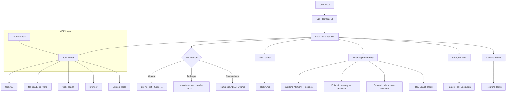

<p align="center">
  <pre>
  ╔══════════════════════════════════════════════════════════════╗
  ║                                                              ║
  ║    ███████╗███╗   ██╗███████╗    ██╗   ██╗██╗   ██╗          ║
  ║    ██╔════╝████╗  ██║██╔════╝    ██║   ██║╚██╗ ██╔╝          ║
  ║    ███████╗██╔██╗ ██║███████╗    ██║   ██║ ╚████╔╝           ║
  ║    ╚════██║██║╚██╗██║╚════██║    ╚██╗ ██╔╝  ╚██╔╝           ║
  ║    ███████║██║ ╚████║███████║     ╚████╔╝    ██║             ║
  ║    ╚══════╝╚═╝  ╚═══╝╚══════╝      ╚═══╝     ╚═╝             ║
  ║                                                              ║
  ║            A G E N T                                         ║
  ║                                                              ║
  ║    Personal AI agent for the terminal                        ║
  ║                                                              ║
  ╚══════════════════════════════════════════════════════════════╝
  </pre>
</p>

<p align="center">
  <strong>Terminal-based AI agent with tool calling, multi-provider LLM support, and extensible skill system.</strong>
</p>

<p align="center">
  <a href="#-quick-start"></a>
  <a href="./LICENSE"></a>
  
  = 20">
  
</p>

---

**SNS MyAgent** is a personal, single-user AI agent CLI forked from [Hermes Agent](https://github.com/NousResearch/hermes-agent) by [Nous Research](https://nousresearch.com). Stripped down and restructured for focused, local-first usage — no server infrastructure, no multi-user overhead.

Use it to run shell commands, search the web, read/write files, automate browsers, and chain complex tasks — all from your terminal, driven by any LLM provider you configure.

---

## Table of Contents

- [Features](#-features)
- [Feature Comparison with Upstream](#-feature-comparison-with-upstream)
- [Architecture](#-architecture)
- [Requirements](#-requirements)
- [Installation](#-installation)
- [Quick Start](#-quick-start)
- [Configuration Reference](#-configuration-reference)
- [CLI Reference](#-cli-reference)
- [Tools](#-tools)
- [Skills](#-skills)
- [Memory System](#-memory-system)
- [Development](#-development)
- [Troubleshooting](#-troubleshooting)
- [FAQ](#-faq)
- [Changelog](#-changelog)
- [Contributing](#-contributing)
- [License](#-license)
- [Credits](#-credits)

---

## Features

| Category | Capability |
|----------|-----------|
| **Multi-provider LLM** | OpenAI, Anthropic, local models (llama.cpp, vLLM, Ollama). Swap providers via config — no code changes. |
| **Tool calling** | Terminal execution, web search, file read/write, browser automation. Agent selects tools per task. |
| **Skill system** | Markdown-based skill files. Load domain-specific workflows dynamically (`/load <skill>`). |
| **Persistent memory** | Mnemosyne memory layer with working/episodic/semantic tiers. Facts, preferences, and context persist across sessions. Full-text search (FTS5). |
| **Terminal UI** | Colored output, markdown rendering, code block syntax highlighting, streaming responses. |
| **Extensible** | Add custom tools, skills, and providers. Plugin architecture via config. |
| **MCP integration** | Connect Model Context Protocol servers for additional tool sources. |
| **Subagent delegation** | Spawn focused subagents for parallel task execution. |
| **Cron scheduling** | Schedule recurring tasks with natural language time expressions. |

---

## Feature Comparison with Upstream

SNS MyAgent is derived from [Hermes Agent](https://github.com/NousResearch/hermes-agent) but focuses on single-user, local-first operation.

| Feature | Hermes Agent (Upstream) | SNS MyAgent |
|---------|------------------------|-------------|
| Multi-provider LLM (300+ models) | ✅ Via Nous Portal + OpenRouter | ✅ Direct provider config |
| Multi-platform messaging (20+ platforms) | ✅ Telegram, Discord, Slack, WhatsApp, Signal, etc. | ❌ Removed — terminal only |
| Desktop app (Windows, macOS) | ✅ | ❌ Not included |
| 60+ built-in tools | ✅ | ✅ Core tools retained |
| Skill system (agentskills.io compatible) | ✅ | ✅ |
| Memory (Mnemosyne: working/episodic/semantic) | ✅ | ✅ |
| Voice mode (CLI, Telegram, Discord) | ✅ | ❌ Removed |
| MCP integration | ✅ | ✅ |
| Cron scheduling | ✅ | ✅ |
| Subagent delegation | ✅ | ✅ |
| 6 deployment backends (Docker, SSH, Singularity, Modal, Daytona) | ✅ | ❌ Local only |
| TUI with multiline, autocomplete, history | ✅ | ✅ |
| Security (command approval, container isolation) | ✅ | ✅ Configurable approval |
| Research (batch processing, trajectory export) | ✅ | ⚠️ Basic |
| Context files (AGENTS.md, SOUL.md) | ✅ | ✅ |
| Multi-user / server deployment | ✅ | ❌ Single-user focus |

---

## Architecture



---

## Requirements

| Dependency | Version | Purpose |
|------------|---------|---------|
| Node.js | ≥ 20.0 | Runtime |
| npm | ≥ 10.0 | Package manager |
| git | ≥ 2.0 | Version control |
| Python | ≥ 3.10 | Local model serving (optional) |

---

## Installation

### Linux / macOS

```bash
git clone https://github.com/Reihantt6/sns-myagent.git
cd sns-myagent
npm install
```

### Windows (PowerShell)

```powershell
git clone https://github.com/Reihantt6/sns-myagent.git
cd sns-myagent
npm install
```

### Verify installation

```bash
node --version   # Should be >= 20.0
npm --version    # Should be >= 10.0
npm start -- --help
```

### Local LLM (Optional)

For local model inference without API keys:

```bash
# Option A: Ollama
curl -fsSL https://ollama.ai/install.sh | sh
ollama pull llama3

# Option B: llama.cpp
# See https://github.com/ggerganov/llama.cpp for build instructions
```

Then configure a custom provider pointing to your local endpoint (see [Configuration Reference](#-configuration-reference)).

---

## Quick Start

### 1. Configure an LLM provider

```bash
cp config.example.yaml config.yaml
# Edit config.yaml — add at least one provider
```

### 2. Set API keys

```bash
export OPENAI_API_KEY="sk-..."
# or
export ANTHROPIC_API_KEY="sk-ant-..."
```

Or create a `.env` file in the project root (git-ignored by default):

```
OPENAI_API_KEY=sk-...
ANTHROPIC_API_KEY=sk-ant-...
```

### 3. Run

```bash
# Interactive mode
npm start

# Single command mode
npm start -- "list all TypeScript files in src/"

# With specific provider
npm start --provider anthropic "explain this codebase"
```

### 4. Try it

```
> what files are in the current directory?
> search the web for "node.js best practices 2025"
> create a Python script that parses CSV files
> /load coding
> refactor the function in src/utils.ts to use async/await
```

---

## Configuration Reference

### `config.yaml`

```yaml
# ── LLM Providers ─────────────────────────────────────────────
providers:
  openai:
    api_key: ${OPENAI_API_KEY}
    model: gpt-4o

  anthropic:
    api_key: ${ANTHROPIC_API_KEY}
    model: claude-sonnet-4-20250514

  custom:
    base_url: http://localhost:11434/v1   # Ollama default
    model: llama3
    api_key: none

# ── Default provider ──────────────────────────────────────────
default_provider: openai

# ── Tools ─────────────────────────────────────────────────────
tools:
  terminal:
    allowed_commands:
      - ls
      - cat
      - git
      - npm
      - node
      - python3
      - curl
    blocked_commands:
      - rm -rf /
      - shutdown
    require_approval: true   # Prompt before executing commands

  browser:
    headless: true

  web_search:
    provider: duckduckgo     # or: brave, serpapi

# ── Memory ────────────────────────────────────────────────────
memory:
  enabled: true
  db_path: ~/.sns-myagent/memory.db
  max_working_entries: 50
  auto_summarize: true

# ── Skills ────────────────────────────────────────────────────
skills:
  directory: ./skills
  auto_load: []              # Skills to load on startup

# ── MCP ───────────────────────────────────────────────────────
mcp:
  servers: []
  # Example:
  # - name: filesystem
  #   command: npx
  #   args: ["-y", "@modelcontextprotocol/server-filesystem", "/path"]

# ── Cron ──────────────────────────────────────────────────────
cron:
  enabled: true

# ── UI ────────────────────────────────────────────────────────
ui:
  theme: dark                # dark | light
  streaming: true
  code_highlight: true
  markdown_render: true
```

### Environment Variables

| Variable | Purpose |
|----------|---------|
| `OPENAI_API_KEY` | OpenAI API key |
| `ANTHROPIC_API_KEY` | Anthropic API key |
| `SNS_MODEL` | Override default model |
| `SNS_PROVIDER` | Override default provider |
| `SNS_CONFIG_PATH` | Custom config file path |
| `SNS_MEMORY_DB` | Custom memory database path |

---

## CLI Reference

```
npm start                       # Interactive mode
npm start -- "<prompt>"         # Single command mode
npm start --provider <name>     # Use specific provider
npm start --model <name>        # Use specific model
npm start --help                # Show help
npm start --version             # Show version
```

### Interactive Commands

| Command | Description |
|---------|-------------|
| `/load <skill>` | Load a skill by name |
| `/unload <skill>` | Unload a skill |
| `/skills` | List available skills |
| `/recall <query>` | Search memory |
| `/memory add <fact>` | Store a memory |
| `/memory list` | List recent memories |
| `/memory clear` | Clear working memory |
| `/provider <name>` | Switch LLM provider mid-session |
| `/model <name>` | Switch model mid-session |
| `/clear` | Clear terminal output |
| `/help` | Show available commands |
| `/exit` | Exit |

---

## Tools

### Built-in Tools

| Tool | Description | Config Key |
|------|-------------|------------|
| `terminal` | Execute shell commands with approval gating | `tools.terminal` |
| `file_read` | Read file contents (with line ranges) | — |
| `file_write` | Write / create / append to files | — |
| `web_search` | Web search via DuckDuckGo, Brave, or SerpAPI | `tools.web_search` |
| `browser` | Headless browser automation (Playwright) | `tools.browser` |

### Custom Tools

Add a tool by creating a file in `src/tools/`:

```typescript
// src/tools/my-tool.ts
import { ToolDefinition } from "../types";

export const definition: ToolDefinition = {
  name: "my_tool",
  description: "Does something useful",
  parameters: {
    type: "object",
    properties: {
      input: {
        type: "string",
        description: "The input value",
      },
    },
    required: ["input"],
  },
};

export async function execute(args: { input: string }): Promise<string> {
  // Implementation
  return `Result for: ${args.input}`;
}
```

Register it in `src/tools/index.ts`:

```typescript
import * as myTool from "./my-tool";

export const tools = [
  // ...existing tools
  myTool,
];
```

### MCP Tool Servers

Connect external tool servers via Model Context Protocol:

```yaml
mcp:
  servers:
    - name: postgres
      command: npx
      args: ["-y", "@modelcontextprotocol/server-postgres", "postgresql://localhost/mydb"]
    - name: github
      command: npx
      args: ["-y", "@modelcontextprotocol/server-github"]
```

---

## Skills

Skills are markdown files that inject context and instructions into the agent for specific task domains.

### Using Skills

```
/load coding           # Load skills/coding.md or skills/coding/
/load web-scraper      # Load skills/web-scraper.md
/skills                # List all available skills
/unload coding         # Remove skill from context
```

### Writing Skills

Create a `.md` file in the `skills/` directory:

```markdown
---
name: deploy-checklist
description: Pre-deployment checklist and commands
tags: [devops, deployment]
---

# Deployment Checklist

Before deploying, verify:

1. All tests pass: `npm test`
2. No lint errors: `npm run lint`
3. Build succeeds: `npm run build`
4. Environment variables are set in production
5. Database migrations are applied

## Commands

- Run full check: `npm run predeploy`
- Deploy: `npm run deploy`
- Rollback: `npm run rollback`
```

### Skill Structure

```
skills/
├── coding.md
├── web-scraper.md
├── research.md
├── deploy-checklist/
│   ├── skill.md        # Main skill file
│   └── templates/      # Optional template files
```

Skills are compatible with [agentskills.io](https://agentskills.io) format.

---

## Memory System

SNS MyAgent uses **Mnemosyne** — a three-tier memory system backed by SQLite with FTS5 full-text search.

### Memory Tiers

| Tier | Scope | Lifetime | Use Case |
|------|-------|----------|----------|
| **Working** | Current session | Session ends | Temporary context, active task state |
| **Episodic** | Cross-session | Persistent | Conversation history, past events |
| **Semantic** | Cross-session | Persistent | Facts, user preferences, learned patterns |

### Commands

```
/recall <query>              # Full-text search across all memory tiers
/memory add <fact>           # Store a new semantic memory
/memory list                 # List recent memories (all tiers)
/memory list --tier episodic # List only episodic memories
/memory clear                # Clear working memory for this session
/memory forget <id>          # Remove specific memory by ID
```

### How It Works

1. **Working memory** holds conversation context within a session. Automatically summarized when it grows too large.
2. **Episodic memory** stores conversation snippets and events. Indexed for retrieval by recency and relevance.
3. **Semantic memory** stores extracted facts and preferences. The agent learns your patterns over time.

Memory is stored at `~/.sns-myagent/memory.db` by default. Override with `SNS_MEMORY_DB` environment variable or `memory.db_path` in config.

---

## Development

```bash
# Install dependencies
npm install

# Build TypeScript
npm run build

# Watch mode (rebuild on change)
npm run dev

# Run tests
npm test

# Lint
npm run lint

# Type check
npm run typecheck
```

### Project Structure

```
sns-myagent/
├── src/
│   ├── index.ts              # Entry point
│   ├── brain/                # LLM orchestration, prompt management
│   │   ├── orchestrator.ts   # Core agent loop
│   │   ├── provider.ts       # Provider abstraction
│   │   └── prompt.ts         # Prompt templates
│   ├── tools/                # Tool implementations
│   │   ├── index.ts          # Tool registry
│   │   ├── terminal.ts       # Shell execution
│   │   ├── file.ts           # File read/write
│   │   ├── web-search.ts     # Web search
│   │   └── browser.ts        # Browser automation
│   ├── memory/               # Mnemosyne memory system
│   │   ├── store.ts          # SQLite + FTS5 backend
│   │   ├── working.ts        # Working memory
│   │   ├── episodic.ts       # Episodic memory
│   │   └── semantic.ts       # Semantic memory
│   ├── skills/               # Skill loader
│   │   └── loader.ts         # Markdown skill parser
│   ├── cli/                  # Terminal UI
│   │   ├── repl.ts           # Interactive REPL
│   │   ├── renderer.ts       # Markdown/code rendering
│   │   └── input.ts          # Input handling
│   └── types/                # TypeScript type definitions
├── skills/                   # Skill files (markdown)
│   ├── coding.md
│   ├── web.md
│   └── research.md
├── config.example.yaml       # Config template
├── tsconfig.json
├── package.json
├── LICENSE
└── README.md
```

---

## Troubleshooting

### API Key Errors

```
Error: Invalid API key for provider 'openai'
```

**Fix:** Verify environment variable is set and not expired:

```bash
echo $OPENAI_API_KEY
# Should print sk-... (not empty)
```

If using `.env` file, ensure it's in the project root and properly formatted (no spaces around `=`, no quotes needed).

### Model Not Found

```
Error: Model 'gpt-4' not available for provider 'openai'
```

**Fix:** Model names are provider-specific. Verify exact model name:

- OpenAI: `gpt-4o`, `gpt-4-turbo`, `gpt-3.5-turbo`
- Anthropic: `claude-sonnet-4-20250514`, `claude-3-5-haiku-20241022`

Check `config.yaml` for typos.

### Permission Denied (Terminal Tool)

```
Error: Command 'rm' not permitted
```

**Fix:** Add to `tools.terminal.allowed_commands` in `config.yaml`:

```yaml
tools:
  terminal:
    allowed_commands:
      - ls
      - cat
      - git
      - rm      # Added
```

Or set `require_approval: false` to approve commands interactively.

### Connection Refused (Local Model)

```
Error: connect ECONNREFUSED 127.0.0.1:11434
```

**Fix:** Ensure your local model server is running:

```bash
# For Ollama
ollama serve

# Verify
curl http://localhost:11434/api/tags
```

### Memory Database Locked

```
Error: SQLITE_BUSY: database is locked
```

**Fix:** Another instance may be running. Kill it:

```bash
pkill -f sns-myagent
```

Or delete the lock file:

```bash
rm ~/.sns-myagent/memory.db-wal ~/.sns-myagent/memory.db-shm
```

---

## FAQ

**Q: How is this different from Hermes Agent?**

SNS MyAgent removes multi-platform messaging, voice mode, desktop app, and multi-deployment backends. It keeps the core agent loop, tools, skills, and memory — optimized for single-user terminal usage.

**Q: Can I use it without API keys (fully local)?**

Yes. Configure Ollama or llama.cpp as a custom provider with `api_key: none`. Set `base_url` to your local endpoint.

**Q: Where is my data stored?**

- Config: `./config.yaml`
- Memory: `~/.sns-myagent/memory.db`
- Logs: `~/.sns-myagent/logs/`

No data is sent to external servers except LLM API calls to your configured provider.

**Q: Can I add my own skills?**

Yes. Create `.md` files in `skills/`. See [Skills](#-skills) section for format.

**Q: How do I switch providers mid-session?**

Use `/provider <name>` in interactive mode. Example: `/provider anthropic`.

**Q: Does it support streaming responses?**

Yes. Enabled by default (`ui.streaming: true` in config). Responses render incrementally as the LLM generates them.

**Q: Can I use multiple providers simultaneously?**

You set a default provider but can switch per-command (`--provider`) or mid-session (`/provider`). Only one provider is active at a time.

---

## Changelog

### v0.1.0 (2025-06-23)

- Initial fork from [Hermes Agent](https://github.com/NousResearch/hermes-agent)
- Removed multi-platform messaging integrations
- Removed voice mode
- Removed desktop app
- Removed multi-deployment backends (Docker, SSH, Singularity, Modal, Daytona)
- Restructured for single-user CLI focus
- Simplified configuration
- Retained core tools, skills, memory, MCP, cron, and subagent systems

---

## Contributing

This is a personal project. Contributions are welcome but may be selectively reviewed.

1. Fork the repository
2. Create a feature branch (`git checkout -b feature/my-change`)
3. Commit with clear messages (`git commit -m "add: new tool for X"`)
4. Push to your fork (`git push origin feature/my-change`)
5. Open a Pull Request

### Commit Convention

```
add:    new feature or file
fix:    bug fix
refactor: code restructuring without behavior change
docs:   documentation changes
test:   test additions or changes
chore:  maintenance tasks
```

### Code Style

- TypeScript with strict mode
- ESLint + Prettier (run `npm run lint` before committing)
- Tests required for new tools

---

## License

[MIT License](./LICENSE) — see [LICENSE](./LICENSE) for full text.

Based on [Hermes Agent](https://github.com/NousResearch/hermes-agent) by [Nous Research](https://nousresearch.com).

---

## Credits

- **Hermes Agent** — [Nous Research](https://nousresearch.com) (upstream project)
- **Reihan** ([@Reihantt6](https://github.com/Reihantt6)) — fork author, maintainer
