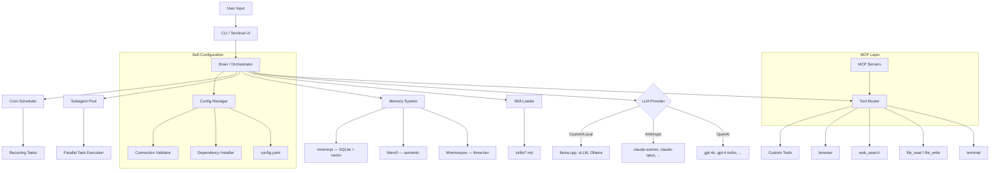

<p align="center">
  <pre>
  ╔══════════════════════════════════════════════════════════════╗
  ║                                                              ║
  ║    ███████╗███╗   ██╗███████╗    ██╗   ██╗██╗   ██╗          ║
  ║    ██╔════╝████╗  ██║██╔════╝    ██║   ██║╚██╗ ██╔╝          ║
  ║    ███████╗██╔██╗ ██║███████╗    ██║   ██║ ╚████╔╝           ║
  ║    ╚════██║██║╚██╗██║╚════██║    ╚██╗ ██╔╝  ╚██╔╝           ║
  ║    ███████║██║ ╚████║███████║     ╚████╔╝    ██║             ║
  ║    ╚══════╝╚═╝  ╚═══╝╚══════╝      ╚═══╝     ╚═╝             ║
  ║                                                              ║
  ║            A G E N T                                         ║
  ║                                                              ║
  ║    Configure your agent by talking to it.                    ║
  ║                                                              ║
  ╚══════════════════════════════════════════════════════════════╝
  </pre>
</p>

<p align="center">
  <strong>The personal AI agent that configures itself through conversation.</strong>
</p>

<p align="center">
  <a href="./LICENSE"></a>
  
  = 1.3.14">
  
  <a href="#-quick-start"></a>
</p>

---

**SNS MyAgent** is a personal, single-user AI agent that **configures itself through conversation**. Describe what you need; the agent installs, configures, and wires everything for you.

No YAML editing. No config archaeology. No setup guides.

> *"Add MCP filesystem"* — the agent installs the server, writes config, verifies the connection.
>
> *"Set up memory with Mnemosyne"* — the agent initializes the three-tier memory system, creates the database, and confirms.
>
> *"Switch to Claude"* — the agent reconfigures the provider, validates the API key, and is ready.

Forked from [oh-my-pi](https://github.com/can1357/oh-my-pi) (Pi Agent ecosystem) and stripped to a focused, local-first, single-user terminal agent.

---

## Table of Contents

- [Why SNS MyAgent?](#-why-sns-myagent)
- [Competitive Landscape](#-competitive-landscape)
- [Conversational Configuration](#-conversational-configuration)
- [Architecture](#-architecture)
- [Requirements](#-requirements)
- [Installation](#-installation) → [Detailed guide](docs/installation.md)
- [Quick Start](#-quick-start)
- [Configuration Reference](#-configuration-reference) → [Detailed config](docs/configuration.md)
- [CLI Reference](#-cli-reference)
- [Tools](#-tools)
- [Skills](#-skills)
- [Memory System](#-memory-system) → [Detailed docs](docs/memory.md)
- [MCP Integration](#-mcp-integration)
- [Development](#-development)
- [Troubleshooting](#-troubleshooting) → [Detailed troubleshooting](docs/troubleshooting.md)
- [FAQ](#-faq) → [Detailed FAQ](docs/faq.md)
- [Contributing](#-contributing) → [CONTRIBUTING.md](CONTRIBUTING.md)
- [Security](#security) → [SECURITY.md](SECURITY.md)
- [Changelog](#changelog) → [CHANGELOG.md](CHANGELOG.md)
- [License](#-license)
- [Credits](#-credits)

---

## Why SNS MyAgent?

Most AI agent CLIs expect the user to configure them before they work. Read the docs, edit YAML, set environment variables, debug connection errors, and repeat.

SNS MyAgent inverts that flow. **The agent is the configuration interface.** Describe what you want in plain language; the agent handles the plumbing.

### What Makes It Different

| Differentiator | Status | Description |
|----------------|--------|-------------|
| **Conversational Configuration** | 🚧 Phase 2 | Add MCP servers, switch memory backends, change providers — all through chat. No manual config editing. |
| **Adaptive Memory** | 🚧 Phase 3 | Choose between Mnemosyne (three-tier), Mem0, or mnemopi (SQLite + vector) — switchable through conversation. |
| **Self-Configuring** | 🚧 Phase 2 | The agent manages its own setup: installs dependencies, writes config files, and verifies connections. |
| **Personal-First** | ✅ Done | Single-user design. No multi-tenancy overhead, no server infrastructure, no auth layers. |
| **Lightweight** | ✅ Done | Stripped from oh-my-pi (Pi Agent ecosystem). Terminal-only, no desktop app, no voice, no multi-platform messaging. Core agent loop + tools + memory. |

---

## Competitive Landscape

| Feature | SNS MyAgent | [Pi](https://github.com/earendil-works/pi) | [oh-my-pi](https://github.com/can1357/oh-my-pi) | [Hermes Agent](https://github.com/NousResearch/hermes-agent) | [OpenClaw](https://github.com/openclaw/openclaw) |
|---------|:-----------:|:--:|:--:|:--:|:--:|
| Conversational configuration | ✅ core design | ❌ | ✅ | ✅ | ❌ |
| Self-configuring agent | ✅ core design | ❌ | ✅ | ✅ | ❌ |
| Memory system | ✅ Mnemosyne / Mem0 / mnemopi | ⚠️ via extension | ✅ mnemopi (SQLite + vector) | ✅ Mnemosyne | ⚠️ via extension |
| Multi-provider LLM | ✅ | ✅ | ✅ (40+ providers) | ✅ | ✅ |
| Tool calling | ✅ | ✅ | ✅ (32 built-in) | ✅ | ✅ |
| MCP integration | ✅ built-in | ⚠️ via extension | ✅ inherited config | ✅ | ✅ |
| Skill system (markdown) | ✅ | ✅ (4000+ packages) | ✅ (inherits from 8 tools) | ✅ | ✅ (ClawHub) |
| Subagent delegation | ✅ | ⚠️ via extension | ✅ built-in | ✅ | ✅ |
| Cron scheduling | ✅ | ❌ | ❌ | ✅ | ✅ |
| Single-user focus | ✅ | ✅ | ✅ | ❌ | ✅ |
| Multi-platform messaging | ❌ | ❌ | ❌ | ✅ (20+) | ✅ (20+) |
| Desktop / mobile app | ❌ | ❌ | ❌ | ✅ | ✅ (macOS/iOS/Android/Win) |
| Multi-user / server deploy | ❌ | ❌ | ❌ | ✅ | ❌ |
| Open source | ✅ MIT | ✅ MIT | ✅ MIT | ✅ | ✅ MIT |

> **Legend:** ✅ = built-in · ⚠️ = available via extension/plugin (not built-in) · ❌ = not available

### Notes

- **Pi** — memory, MCP, and subagent are available through the [marketplace extension](https://pi.dev/packages) (4000+ packages), not built-in. Manual installation required.
- **oh-my-pi** — memory built-in (mnemopi: SQLite + vector embeddings + graph). MCP inherited from other config tools (Cursor, Claude Code, etc.). 32 built-in tools, LSP integration.
- **Hermes Agent** — TypeScript-based agent framework with multi-platform and multi-user focus. Not a single-user terminal agent.
- **OpenClaw** — Personal AI assistant with multi-platform and desktop apps. Single-user and local-first.

**Bottom line:** SNS MyAgent and oh-my-pi share the conversational-configuration model. SNS MyAgent is purpose-built for single-user terminal use — lightweight, local-first, and zero multi-platform overhead. oh-my-pi delivers similar capabilities inside a larger multi-platform, multi-user package.

---

## Conversational Configuration

This is the core feature. Examples:

### Add an MCP server

```
You: add MCP filesystem for /home/user/projects

Agent: Installing @modelcontextprotocol/server-filesystem...
       Writing config to config.yaml...
       Testing connection... OK.
       MCP filesystem server ready for /home/user/projects.
```

### Switch memory backend

```
You: switch memory to Mem0

Agent: Configuring Mem0 as memory backend...
       Updating config.yaml memory section...
       Migrating existing memories... 12 entries transferred.
       Memory backend switched to Mem0.
```

### Configure a new LLM provider

```
You: add anthropic with claude-sonnet

Agent: Checking for ANTHROPIC_API_KEY... found.
       Adding Anthropic provider to config...
       Testing connection... OK.
       Anthropic Claude Sonnet available. Use /provider anthropic to switch.
```

### Set up local model

```
You: setup ollama with llama3

Agent: Checking Ollama installation... not found.
       Installing Ollama...
       Pulling llama3 model... done.
       Writing custom provider config...
       Local model ready. Use /provider custom to switch.
```

The agent understands context. "Setup memory" means initialize memory. "Add MCP" means install and configure. "Switch to Claude" means change provider. Natural language, not syntax.

---

## Architecture



---

## Requirements

| Dependency | Minimum | Recommended | Purpose |
|------------|---------|-------------|---------|
| **Bun** *(for building from source)* | 1.3.14 | Latest | Compile-time toolchain + `bun add -g` path |
| **Node.js** *(for npm path)* | 18.0 | 22.x LTS | Runs `postinstall` to fetch the prebuilt binary |
| **Git** | 2.0 | Latest | Version control |
| **Python** | 3.10 | 3.12+ | Local model serving (optional) |
| **RAM** | 2 GB free | 4 GB+ | Agent + memory |
| **Disk** | 500 MB | 2 GB+ | Skills + memory DB |

At runtime you need **either** Bun (>= 1.3.14) **or** Node.js (>= 18) — not both. The Bun path uses `bun add -g @sns-myagent/cli`; the Node path uses `npm install -g @sns-myagent/cli`. Both end with the same `snscoder` binary on your `$PATH`.

---

## Installation

> **Dual-runtime supported.** `snscoder` runs as a Bun-built binary (recommended) **or** as a prebuilt platform binary downloaded on `npm install` (Node.js 18+). Pick the path that fits your environment:

### Option 1: One-liner (Recommended — Linux / macOS / WSL / RDP)

```bash
curl -fsSL https://raw.githubusercontent.com/Reihantt6/sns-myagent/main/install.sh | bash
```

Installs Bun (via the install script if needed) plus `snscoder` globally. Works on Linux, macOS, and WSL2.

### Option 2: Bun Global Install

```bash
bun install -g snscoder
snscoder
```

### Option 3: npx (Run without installing)

```bash
npx snscoder
```

### Option 4: Clone (Development)

```bash
git clone https://github.com/Reihantt6/sns-myagent.git
cd sns-myagent
bun install
bun run dev    # watch mode
# or
bun run build && bun dist/cli.js   # production
```

### Option 5: Windows PowerShell

```powershell
irm raw.githubusercontent.com/Reihantt6/sns-myagent/main/install.ps1 | iex
```

Uses npm under the hood (the postinstall hook downloads the Windows prebuilt binary). A `-UseBun` switch is available for contributors who already have Bun installed.

### Option 6: Universal (npm, all platforms)

```bash
npm install -g @sns-myagent/cli
```

Works on Linux, macOS, Windows, and WSL without any runtime prerequisite beyond Node.js 18+. The `postinstall` step downloads the matching prebuilt binary into the package's `bin/` directory. If a release hasn't been published yet, the script prints a friendly warning and exits cleanly — your install will still succeed; you can re-run `npm rebuild` after the maintainer publishes v0.1.0.

### Option 7: From source (contributors)

```bash
git clone https://github.com/Reihantt6/sns-myagent
cd sns-myagent
bun install          # requires Bun >= 1.3.14
bun run build        # produces dist/omp (the snscoder binary)
```

Then either run `bun dist/omp` directly, or `bun add -g .` to link the build as your global `snscoder`.

### Verify Installation

```bash
bun --version      # >= 1.3.14
snscoder --version # 0.1.0
```

### Local LLM (Optional, No API Key Needed)

```bash
curl -fsSL https://ollama.ai/install.sh | sh
ollama pull llama3
```

Or let the agent do it: run `snscoder` and say *"setup ollama with llama3"*.

> **Detailed installation guide:** [docs/installation.md](docs/installation.md)

---

## Quick Start

### 1. Set an API key

```bash
export OPENAI_API_KEY="sk-..."
# or
export ANTHROPIC_API_KEY="sk-ant-..."
```

Or create `.env` in the project root:

```
OPENAI_API_KEY=sk-...
```

### 2. Run

```bash
snscoder
```

### 3. Let the agent configure itself

```
> add MCP filesystem for /home/user/projects
> setup memory with Mnemosyne
> switch to anthropic with claude-sonnet
> load coding skill
```

### 4. Then use it

```
> what files are in the current directory?
> search the web for "node.js best practices 2025"
> create a Python script that parses CSV files
> refactor the function in src/utils.ts to use async/await
> /memory view
```

No `config.yaml` editing required. The agent handles it.

---

## Configuration Reference

Manual configuration is still supported. Config lives at `./config.yaml`.

```yaml
# ── LLM Providers ─────────────────────────────────────────────
providers:
  openai:
    api_key: ${OPENAI_API_KEY}
    model: gpt-4o

  anthropic:
    api_key: ${ANTHROPIC_API_KEY}
    model: claude-sonnet-4-20250514

  custom:
    base_url: http://localhost:11434/v1   # Ollama default
    model: llama3
    api_key: none

# ── Default provider ──────────────────────────────────────────
default_provider: openai

# ── Tools ─────────────────────────────────────────────────────
tools:
  terminal:
    allowed_commands:
      - ls
      - cat
      - git
      - bun
      - python3
      - curl
    blocked_commands:
      - rm -rf /
      - shutdown
    require_approval: true

  browser:
    headless: true

  web_search:
    provider: duckduckgo     # or: brave, serpapi

# ── Memory ────────────────────────────────────────────────────
memory:
  enabled: true
  backend: mnemosyne         # mnemosyne | mem0 | mnemopi
  db_path: ~/.sns-myagent/memory.db
  max_working_entries: 50
  auto_summarize: true

# ── Skills ────────────────────────────────────────────────────
skills:
  directory: ./skills
  auto_load: []

# ── MCP ───────────────────────────────────────────────────────
mcp:
  servers: []
  # Example:
  # - name: filesystem
  #   command: npx
  #   args: ["-y", "@modelcontextprotocol/server-filesystem", "/path"]

# ── Cron ──────────────────────────────────────────────────────
cron:
  enabled: true

# ── UI ────────────────────────────────────────────────────────
ui:
  theme: dark                # dark | light
  streaming: true
  code_highlight: true
  markdown_render: true
```

### Environment Variables

| Variable | Purpose |
|----------|---------|
| `OPENAI_API_KEY` | OpenAI API key |
| `ANTHROPIC_API_KEY` | Anthropic API key |
| `SNS_MODEL` | Override default model |
| `SNS_PROVIDER` | Override default provider |
| `SNS_CONFIG_PATH` | Custom config file path |
| `SNS_MEMORY_DB` | Custom memory database path |

---

## CLI Reference

```
snscoder                          # Interactive mode
snscoder "<prompt>"               # Single command mode
snscoder --provider <name>        # Use specific provider
snscoder --model <name>           # Use specific model
snscoder --help                   # Show help
snscoder --version                # Show version
```

### Interactive Commands

SNS MyAgent ships **58 built-in slash commands** registered in `src/slash-commands/builtin-registry.ts`. Commands fall into six groups:

#### Session & Navigation
| Command | Description |
|---------|-------------|
| `/new` | Start a new session |
| `/fresh` | Close the current provider session and start fresh |
| `/session [info\|delete]` | Show session info, or delete the persisted session file |
| `/rename <title>` | Rename the current session |
| `/resume` | Resume a previous session |
| `/drop` | Drop a session from history |
| `/compact` | Compact the conversation context |
| `/shake` | Shake-style compaction modes |
| `/handoff` | Produce a HANDOFF.md for the next agent |
| `/exit` / `/quit` | Exit snscoder |

#### Model & Provider
| Command | Description |
|---------|-------------|
| `/model` | Open the model picker (same as alt+m) |
| `/switch` | Switch model for this session (same as alt+p) |
| `/fast [on\|off\|status]` | Toggle fast-mode (OpenAI/Claude-only modes) |
| `/login` | Sign in to a provider |
| `/logout` | Sign out |
| `/setup` | Open provider setup wizard |

#### Memory
| Command | Description |
|---------|-------------|
| `/memory view` | Show current memory injection payload |
| `/memory stats` | Show memory backend statistics |
| `/memory diagnose` | Run memory backend diagnostics |
| `/memory clear` | Clear persisted memory data and artifacts |
| `/memory enqueue` | Enqueue memory consolidation maintenance |
| `/memory mm list\|show\|refresh\|history\|seed\|delete\|reload` | Mental-model maintenance |

#### Goals & Planning
| Command | Description |
|---------|-------------|
| `/plan` | Enter planning mode |
| `/plan-review` | Review the active plan |
| `/goal <set\|show\|pause\|resume\|drop\|budget>` | Long-running goal orchestration |
| `/guided-goal` | Guided goal walkthrough |
| `/loop` | Configure loop control |
| `/btw` / `/tan` / `/omfg` | Quick side-question commands |

#### Tools, Context & Extensions
| Command | Description |
|---------|-------------|
| `/tools` | Show tools currently visible to the agent |
| `/context` | Show context-window breakdown |
| `/mcp [reload]` | Show MCP server status / force reload runtime tools |
| `/ssh` | Run a command on a remote SSH host |
| `/extensions` | Show loaded extensions |
| `/plugins` | Show installed plugins |
| `/marketplace` | Open the marketplace manager |
| `/reload-plugins` | Reload plugin registry |
| `/agents` | List subagents |
| `/advisor [on\|off\|status\|dump]` | Advisor subagent control |
| `/browser [headless\|visible]` | Switch browser visibility mode |

#### Output & Sharing
| Command | Description |
|---------|-------------|
| `/copy` | Copy last assistant response to clipboard |
| `/export` | Export session to file |
| `/dump` | Dump raw session transcript |
| `/share` | Share session via collab link |
| `/collab [view\|status\|stop]` | Live collab (host a session for others to join) |
| `/join <link>` | Join a collab session as a guest |
| `/leave` | Leave the current collab session |
| `/todo <edit\|copy\|export\|import\|append\|start\|done\|drop\|rm>` | Markdown todo list management |
| `/jobs` | Show async background jobs |
| `/usage [show\|reset]` | Show provider token usage, or reset Codex rate-limit |
| `/stats [--port]` | Launch local stats dashboard |
| `/changelog [full]` | Show recent changelog entries |
| `/hotkeys` | Show keyboard shortcuts |
| `/retry` | Retry the last prompt |
| `/debug` | Toggle debug logging |

> Skills and extensions contribute additional commands at runtime (see `/skills` listed dynamically by `available-commands.ts`). Use **Tab** in the TUI for autocomplete of every command.

---

## Tools

### Built-in Tools

| Tool | Description | Config Key |
|------|-------------|------------|
| `terminal` | Execute shell commands with approval gating | `tools.terminal` |
| `file_read` | Read file contents (with line ranges) | — |
| `file_write` | Write / create / append to files | — |
| `web_search` | Web search via DuckDuckGo, Brave, or SerpAPI | `tools.web_search` |
| `browser` | Headless browser automation (Playwright) | `tools.browser` |

### Custom Tools

Create a file in `src/tools/`:

```typescript
// src/tools/my-tool.ts
import { ToolDefinition } from "../types";

export const definition: ToolDefinition = {
  name: "my_tool",
  description: "Does something useful",
  parameters: {
    type: "object",
    properties: {
      input: {
        type: "string",
        description: "The input value",
      },
    },
    required: ["input"],
  },
};

export async function execute(args: { input: string }): Promise<string> {
  return `Result for: ${args.input}`;
}
```

Register in `src/tools/index.ts`:

```typescript
import * as myTool from "./my-tool";

export const tools = [
  // ...existing tools
  myTool,
];
```

---

## Skills

Markdown files that inject domain context into the agent.

### Using Skills

```
/load coding           # Load skills/coding.md
/load web-scraper      # Load skills/web-scraper.md
/skills                # List available
/unload coding         # Remove from context
```

Or through conversation: *"load the coding skill"*.

### Writing Skills

Create an `.md` file in `skills/`:

```markdown
---
name: deploy-checklist
description: Pre-deployment checklist and commands
tags: [devops, deployment]
---

# Deployment Checklist

Before deploying, verify:

1. All tests pass: `bun test`
2. No lint errors: `bun run lint`
3. Build succeeds: `bun run build`
4. Environment variables are set in production
5. Database migrations are applied

## Commands

- Run full check: `bun run predeploy`
- Deploy: `bun run deploy`
- Rollback: `bun run rollback`
```

### Skill Structure

```
skills/
├── coding.md
├── web-scraper.md
├── research.md
├── deploy-checklist/
│   ├── skill.md        # Main skill file
│   └── templates/      # Optional template files
```

Compatible with [agentskills.io](https://agentskills.io) format.

---

## Memory System

Three memory backends, switchable through conversation or config.

### Option 1: Mnemosyne (Default)

Three-tier memory backed by SQLite + FTS5 full-text search.

| Tier | Scope | Lifetime | Use Case |
|------|-------|----------|----------|
| **Working** | Current session | Session ends | Temporary context, active task state |
| **Episodic** | Cross-session | Persistent | Conversation history, past events |
| **Semantic** | Cross-session | Persistent | Facts, user preferences, learned patterns |

### Option 2: Mem0

Semantic memory layer with vector embeddings + fact extraction from conversations.

**Deployment modes:**

| Mode | Requirements | Cost |
|------|-------------|------|
| **Cloud** (app.mem0.ai) | Account + API key | Free (10K memories) → $19-$249/mo |
| **Self-hosted** (Docker) | Docker, PostgreSQL + pgvector, LLM API key | Free (Apache 2.0), pay infra only |
| **Library** (`pip install mem0ai`) | Python, vector DB (Qdrant / Chroma / FAISS / PGVector) | Free, no server needed |
| **Local (Ollama)** | Ollama (llama3.2:1b + bge-m3), ChromaDB | Fully local, no cloud dependency |

**Quick self-host setup:**

```bash
git clone https://github.com/mem0ai/mem0
cd mem0/server
docker compose up -d
make bootstrap  # creates admin + API key
```

**Capabilities:** semantic search, fact extraction, entity linking, temporal reasoning, 24+ vector-store backends, graph memory (Neo4j, Pro+ cloud only).

**Limitations:** memory staleness after 30 days (~49% accuracy at scale), LLM dependency on every `add()` call, graph memory costs $249/mo on cloud (free when self-hosted).

### Option 3: mnemopi

Default fork from oh-my-pi. SQLite + vector embeddings + graph. Built-in to the agent with zero setup. Best general-purpose option.

### Option 4: LCM (Latent Context Memory)

Compressed context representation. Efficient for long-running sessions with large context windows.

### Switching Backends

Through conversation:

```
> switch memory to Mem0
```

Or through config:

```yaml
memory:
  backend: mem0  # mnemosyne | mem0 | mnemopi | lcm
```

### Memory Commands

```
/recall <query>              # Full-text search across all memory tiers
/memory add <fact>           # Store a new semantic memory
/memory list                 # List recent memories
/memory list --tier episodic # Filter by tier
/memory clear                # Clear working memory
/memory forget <id>          # Remove a specific memory
```

### Data Location

- Config: `./config.yaml`
- Memory DB: `~/.sns-myagent/memory.db` (override with `SNS_MEMORY_DB`)
- Logs: `~/.sns-myagent/logs/`

No data is sent to external servers except for LLM API calls to the configured provider.

> **Detailed memory docs:** [docs/memory.md](docs/memory.md)

---

## MCP Integration

Connect Model Context Protocol servers for additional tools.

### Through Conversation

```
> add MCP postgres for postgresql://localhost/mydb
> add MCP github
```

The agent installs the server package, writes config, and verifies the connection.

### Manual Config

```yaml
mcp:
  servers:
    - name: postgres
      command: npx
      args: ["-y", "@modelcontextprotocol/server-postgres", "postgresql://localhost/mydb"]
    - name: github
      command: npx
      args: ["-y", "@modelcontextprotocol/server-github"]
```

### Popular Servers

| Server | Package | Description |
|--------|---------|-------------|
| Filesystem | `@modelcontextprotocol/server-filesystem` | File operations on local directories |
| PostgreSQL | `@modelcontextprotocol/server-postgres` | Database queries |
| GitHub | `@modelcontextprotocol/server-github` | GitHub API (repos, issues, PRs) |
| Slack | `@modelcontextprotocol/server-slack` | Slack workspace operations |

---

## Development

```bash
bun install          # Install dependencies
bun run build        # Build TypeScript
bun run dev          # Watch mode
bun test             # Run tests
bun run lint         # Lint
bun run typecheck    # Type check
```

### Project Structure

```
sns-myagent/
├── src/
│   ├── index.ts                  # Entry point
│   ├── main.ts                   # Bootstrap
│   ├── cli.ts                    # CLI runner
│   ├── cli-commands.ts           # Slash-command registry
│   ├── system-prompt.ts          # System prompt assembly
│   ├── commands/                 # Subcommands (chat, setup, models, ...)
│   │   ├── chat.ts
│   │   ├── setup.ts
│   │   ├── models.ts
│   │   └── ...
│   ├── config/                   # Config system (YAML, defaults, resolver)
│   │   ├── sns-config.ts         # Main config loader
│   │   ├── settings.ts           # Settings schema + accessors
│   │   ├── defaults.ts           # Default provider / model / paths
│   │   └── model-registry.ts     # Provider + model catalog
│   ├── ui/                       # Branded terminal UI
│   │   ├── banner.ts             # ASCII logo
│   │   ├── colors.ts             # Brand palette (picocolors)
│   │   ├── spinner.ts            # ora spinner
│   │   ├── chat-prompt.ts        # Styled input prompt
│   │   └── status-bar.ts         # Bottom status bar
│   ├── mcp/                      # MCP client + servers
│   ├── tools/                    # Built-in tools
│   ├── mnemopi/                  # Built-in SQLite + vector memory
│   ├── memory-backend/           # Memory backend adapters
│   ├── skills/                   # Skill loader
│   ├── sessions/                 # Session DAG + history
│   ├── prompts/                  # Prompt templates
│   ├── tui/                      # Textual-style TUI runtime
│   └── ...
├── scripts/                      # Build + dev scripts
├── examples/                     # Example configs and snippets
├── docs/                         # Detailed documentation
│   ├── installation.md
│   ├── configuration.md
│   ├── memory.md
│   ├── tbm.md
│   ├── troubleshooting.md
│   ├── faq.md
│   └── terminal-ui.md
├── package.json
├── tsconfig.json
├── install.sh
├── LICENSE
├── SECURITY.md
├── CONTRIBUTING.md
├── CHANGELOG.md
└── README.md
```

---

## Troubleshooting

### API Key Errors

```
Error: Invalid API key for provider 'openai'
```

Fix: verify the environment variable is set:

```bash
echo $OPENAI_API_KEY
```

Or tell the agent: *"reconfigure openai, my API key is sk-..."*.

### Model Not Found

```
Error: Model 'gpt-4' not available for provider 'openai'
```

Fix: check the exact model name in `config.yaml`. OpenAI uses `gpt-4o`, `gpt-4-turbo`. Anthropic uses `claude-sonnet-4-20250514`.

Or: *"switch to gpt-4o"*.

### Permission Denied (Terminal Tool)

```
Error: Command 'rm' not permitted
```

Fix: add the command to `tools.terminal.allowed_commands` in config, or tell the agent: *"allow rm command"*.

### Connection Refused (Local Model)

```
Error: connect ECONNREFUSED 127.0.0.1:11434
```

Fix: ensure the local model server is running:

```bash
ollama serve
curl http://localhost:11434/api/tags
```

Or: *"restart ollama"*.

### Memory Database Locked

```
Error: SQLITE_BUSY: database is locked
```

Fix: another instance is running. Kill it:

```bash
pkill -f sns-myagent
rm ~/.sns-myagent/memory.db-wal ~/.sns-myagent/memory.db-shm
```

---

## FAQ

**Q: How is this different from oh-my-pi / Pi Agent?**

oh-my-pi / Pi Agent is a TypeScript-based agent framework with multi-platform and multi-user features. SNS MyAgent strips it down to a focused, local-first, single-user terminal agent with conversational configuration.

**Q: How is this different from other agent CLIs?**

Most agent CLIs (Pi, omp) require manual configuration. SNS MyAgent configures itself through conversation — same model as oh-my-pi (its upstream), but purpose-built for single-user terminal use. Say "add MCP filesystem" and it installs, configures, and tests. oh-my-pi offers the same flow inside a larger multi-platform, multi-user package.

**Q: Can I use it without API keys (fully local)?**

Yes. Tell the agent: *"setup ollama with llama3"*. It installs Ollama, pulls the model, and configures the provider. Or manually set `custom` provider with `api_key: none`.

**Q: Where is my data stored?**

- Config: `./config.yaml`
- Memory: `~/.sns-myagent/memory.db`
- Logs: `~/.sns-myagent/logs/`

No data is sent to external servers except LLM API calls.

**Q: Can I add my own skills?**

Yes. Create `.md` files in `skills/`. See [Skills](#-skills).

**Q: How do I switch providers mid-session?**

`/provider <name>` or say *"switch to anthropic"*.

**Q: Can I use multiple providers simultaneously?**

One active at a time. Switch per-command (`--provider`) or mid-session.

**Q: Does it support streaming responses?**

Yes. Enabled by default (`ui.streaming: true`).

**Q: Which memory backend should I use?**

- **Mnemosyne** (default): best general-purpose. Three tiers, full-text search.
- **Mem0**: better for preference/fact extraction from conversations.
- **mnemopi**: built-in, zero setup. SQLite + vector + graph.
- **LCM**: better for long sessions where context window is a constraint.

Switch any time: *"switch memory to Mem0"*.

---

## Contributing

Contributions are welcome and selectively reviewed.

1. Fork the repository
2. Create a feature branch (`git checkout -b feature/my-change`)
3. Commit with clear messages (`git commit -m "add: new tool for X"`)
4. Push to your fork (`git push origin feature/my-change`)
5. Open a Pull Request

### Commit Convention

```
add:      new feature or file
fix:      bug fix
refactor: code restructuring without behavior change
docs:     documentation changes
test:     test additions or changes
chore:    maintenance tasks
```

### Code Style

- TypeScript with strict mode
- ESLint + Prettier (run `bun run lint` before committing)
- Tests required for new tools

---

## Security

See [SECURITY.md](SECURITY.md) for:

- Vulnerability reporting process
- Security model (local-first, no telemetry)
- API key handling
- Best practices

---

## Changelog

See [CHANGELOG.md](CHANGELOG.md) for release history.

---

## License

[MIT License](./LICENSE).

Based on [oh-my-pi](https://github.com/can1357/oh-my-pi) (Pi Agent ecosystem).

---

## Credits

- **oh-my-pi / Pi Agent** — [can1357](https://github.com/can1357/oh-my-pi) — upstream project
- **Reihan** ([@Reihantt6](https://github.com/Reihantt6)) — fork author, maintainer
