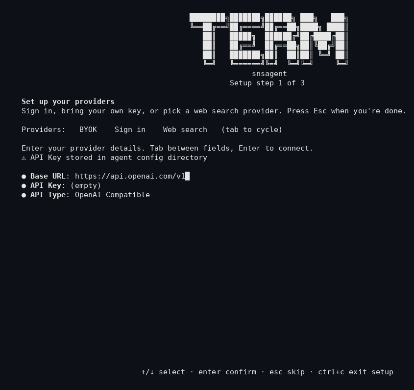
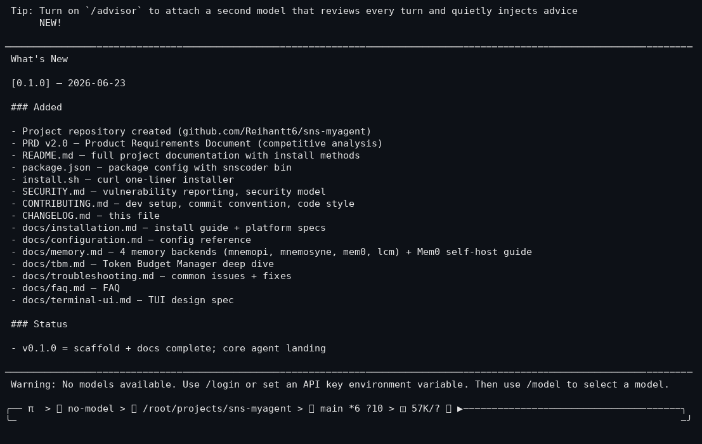
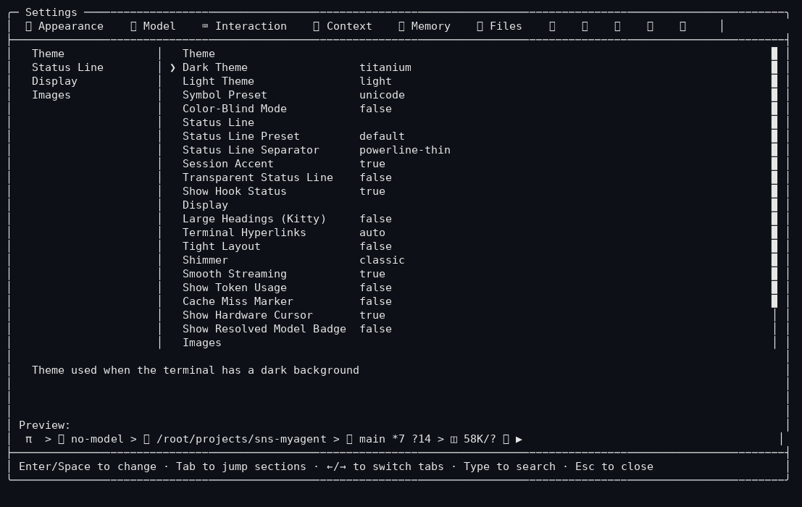
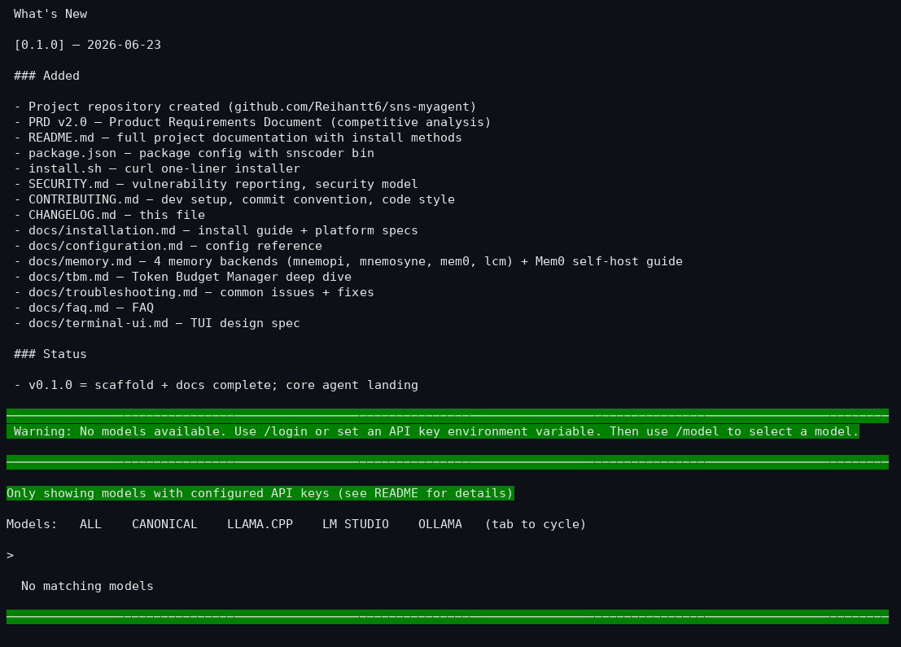
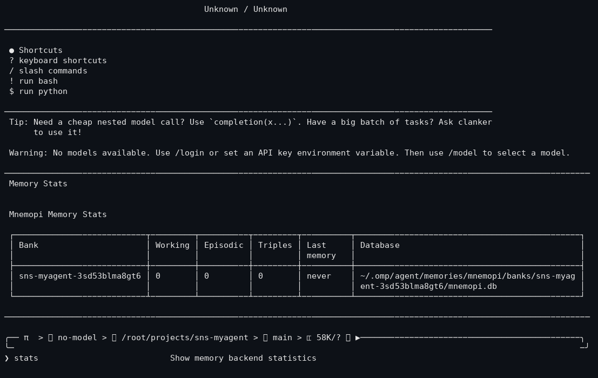
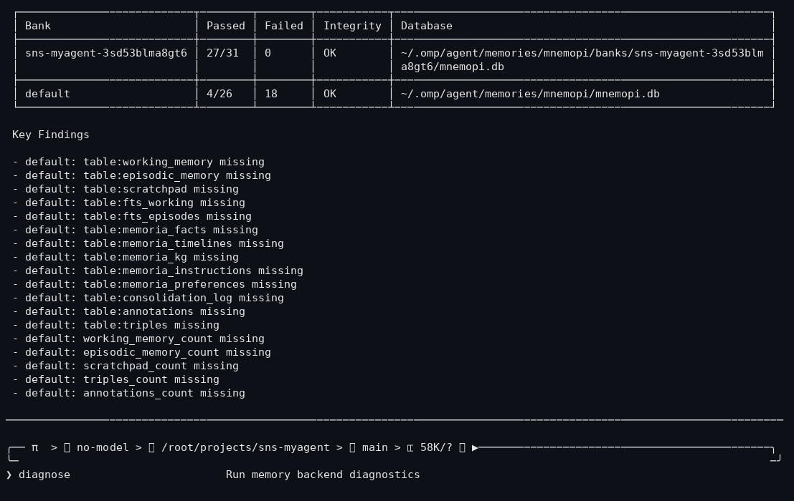
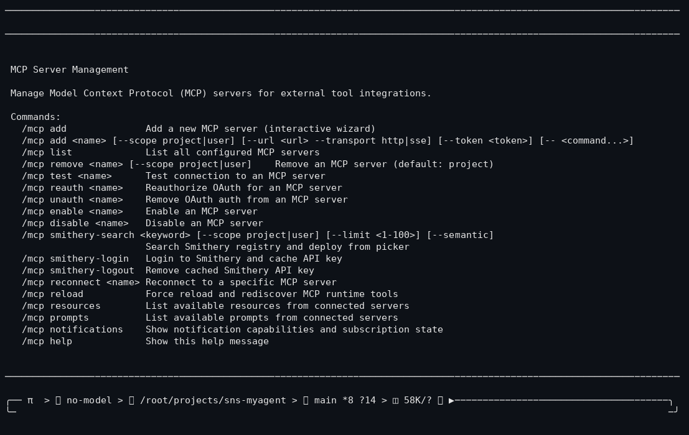
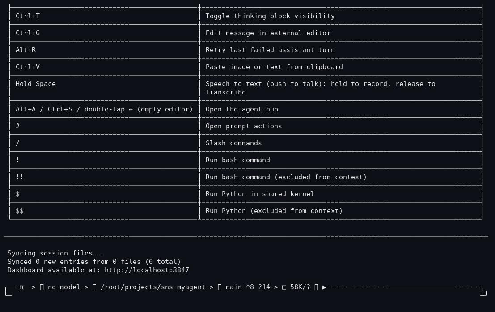
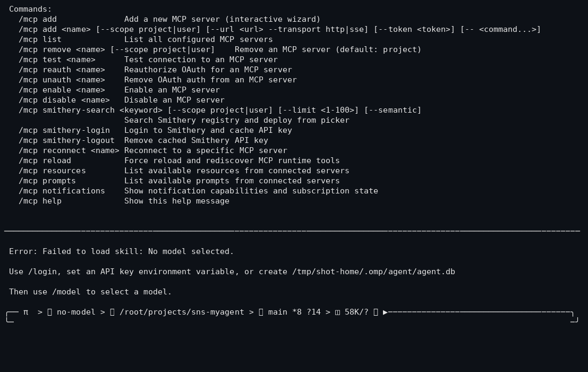

<p align="center">
  <pre>
  ╔══════════════════════════════════════════════════════════════╗
  ║                                                              ║
  ║    ███████╗███╗   ██╗███████╗    ██╗   ██╗██╗   ██╗          ║
  ║    ██╔════╝████╗  ██║██╔════╝    ██║   ██║╚██╗ ██╔╝          ║
  ║    ███████╗██╔██╗ ██║███████╗    ██║   ██║ ╚████╔╝           ║
  ║    ╚════██║██║╚██╗██║╚════██║    ╚██╗ ██╔╝  ╚██╔╝           ║
  ║    ███████║██║ ╚████║███████║     ╚████╔╝    ██║             ║
  ║    ╚══════╝╚═╝  ╚═══╝╚══════╝      ╚═══╝     ╚═╝             ║
  ║                                                              ║
  ║          S N S A G E N T                                     ║
  ║                                                              ║
  ║    Configure snsagent by talking to it.                      ║
  ║                                                              ║
  ╚══════════════════════════════════════════════════════════════╝
  </pre>
</p>

<p align="center">
  <strong>BYOK coding agent CLI — bring your own key, configure it by talking to it. Multi-provider LLM, memory, MCP, subagents, Telegram.</strong>
</p>

<p align="center">
  
  
  = 1.3.14">
</p>

---

**snsagent** is a personal, single-user AI coding agent for the terminal. Bring your own
API key (BYOK), talk to the agent, and it configures itself — MCP servers, memory backends,
model switching — through conversation. No forced subscription; the ~120 MB binary is yours
to run anywhere.

---

## Table of Contents

- [Screenshots](#screenshots)
- [Features](#features)
- [Quick Start](#quick-start)
- [Installation](#installation)
- [Termux (Android)](#termux-android)
- [Configuration](#configuration)
- [Telegram](#telegram)
- [Architecture](#architecture)
- [Documentation](#documentation)
- [Development](#development)
- [Security](#security)
- [License](#license)

---

## Screenshots

Captured from the current build (interactive screens run via `bun run src/cli/entry.ts`;
see the note below about the compiled binary). Click any thumbnail for the full-size image in
[`docs/screenshots/`](./docs/screenshots/).

| Screen | Image |
|--------|-------|
| Setup wizard — BYOK provider |  |
| Main TUI |  |
| `/settings` panel |  |
| `/model` picker |  |
| `/memory stats` |  |
| `/memory diagnose` |  |
| `/mcp` surface |  |
| `/stats` dashboard |  |
| Error state (no model) |  |

> **Compiled binary note.** `./bin/snsagent-linux-x64` (and the npm-installed binary) runs in
> "JS-only mode" — the native pty/grep/shell addon is not embedded, so the *interactive TUI*
> does not render there. The source-run path above is the supported path for the interactive
> UI. See [docs/troubleshooting.md](./docs/troubleshooting.md).

---

## Features

Status legend: **VERIFIED** = a real integration path was demonstrated (not just a green unit
test). **PARTIAL** = implemented and partly tested, but not deep-audited end-to-end.
**UNTESTED** = implemented, no committed test. **BROKEN** = dead/unreachable code.

| Feature | Status | Evidence |
|---------|--------|----------|
| **30 built-in tools** | VERIFIED | `src/tools/builtin-names.ts` (all real implementations) |
| **62 slash commands** (+ 4 aliases) | VERIFIED | `src/slash-commands/builtin-registry.ts` |
| **Multi-provider LLM** (OpenAI, Anthropic, Ollama, custom) | VERIFIED | `src/modes/setup-wizard/` + provider registry |
| **BYOK setup wizard** | VERIFIED | `src/modes/setup-wizard/` + tests + screenshots |
| **Memory — mnemopi** (default recommended) | VERIFIED | `src/memory-backend/__tests__/memory-integration.test.ts` (30 tests: retain → persist → recall → inject) |
| **Memory — hindsight** (remote service) | PARTIAL | `src/hindsight/`; needs `hindsight.apiUrl` service — [docs/memory.md](./docs/memory.md) |
| **Memory — mem0 / lcm / local** | PARTIAL | manual save/search; **no auto-recall/injection** — [docs/memory.md](./docs/memory.md) |
| **Memory — mnemosyne** | BROKEN | migrated to `mnemopi` at config load; dead enum value — [docs/memory.md](./docs/memory.md) |
| **TBM (token budget manager)** | VERIFIED (integrated) | `src/tbm/session-hooks.ts` wired into the turn lifecycle; default **OFF**. No savings claim without the measured benchmark — [docs/tbm.md](./docs/tbm.md) |
| **Telegram bot** | PARTIAL | `src/adapters/telegram/`; auth via opt-in `SNS_TELEGRAM_ALLOWED_USERS` — [docs/telegram.md](./docs/telegram.md) |
| **MCP integration** | PARTIAL | `src/mcp/` (22 files); `/mcp` surface verified — [docs/mcp.md](./docs/mcp.md) |
| **Plan mode** | PARTIAL | `src/plan-mode/` — [docs/plan-mode.md](./docs/plan-mode.md) |
| **Goal mode** | PARTIAL | `src/goals/` (token budget + lifecycle) — [docs/goals.md](./docs/goals.md) |
| **Subagents / multi-agent** | PARTIAL | `src/task/`, `src/agents/` (consensus/critic/best-of-N) — [docs/subagents.md](./docs/subagents.md) |
| **Advisor** (second-model review) | VERIFIED | `src/advisor/` + `advisor.test.ts` — [docs/advisor.md](./docs/advisor.md) |
| **Cron scheduler** | PARTIAL | `src/cron/` + parser tests — [docs/cron.md](./docs/cron.md) |
| **Browser automation** (Puppeteer) | PARTIAL | `src/tools/browser/` — [docs/browser.md](./docs/browser.md) |
| **SSH remote execution** | PARTIAL | `src/tools/ssh.ts` |
| **Eval backends** (Python/JS/Ruby/Julia) | VERIFIED | `src/eval/` + eval tests |
| **Context compaction** | PARTIAL | `src/session/` (multiple strategies) — [docs/compaction.md](./docs/compaction.md) |
| **Plugins / skills** | UNTESTED | `src/extensibility/` (implemented, no committed test) — [docs/extensibility.md](./docs/extensibility.md) |
| **Collaborative sessions** | UNTESTED | `src/collab/` (implemented, no committed test) — [docs/collab.md](./docs/collab.md) |
| **LSP integration** | PARTIAL | `src/lsp/` |
| **Text-to-speech / STT** | PARTIAL | `src/tts/`, `src/stt/` |
| **Todo system** | PARTIAL | `src/` todo helpers |

Full findings: [`AUDIT-REPORT.md`](./AUDIT-REPORT.md),
[`AUDIT-BASELINE.md`](./AUDIT-BASELINE.md),
[docs/security-model.md](./docs/security-model.md).

---

## Quick Start

### 1. Run

```bash
snsagent
```

First launch opens the setup wizard — choose a provider (or custom Base URL), enter an API
key, pick a model, and start chatting.

### 2. Use it

```text
> what files are in the current directory?
> search the web for "bun runtime benchmarks"
> create a TypeScript module that parses CSV files
> refactor src/utils/edit-mode.ts to use async/await
```

### 3. Configure through conversation

```text
> add MCP filesystem for /home/user/projects
> switch to anthropic with claude-sonnet
> load coding skill
```

Or set the key directly via environment — the agent picks it up on launch:

```bash
export OPENAI_API_KEY="your-key-here"   # or ANTHROPIC_API_KEY, etc.
snsagent
```

---

## Installation

### npm (recommended for most users)

```bash
npm install -g @sns-myagent/cli
snsagent
```

The package downloads the platform binary during install. Requires Node.js 18+; works on
Linux, macOS, Windows, and WSL.

### One-liner installer

```bash
curl -fsSL https://raw.githubusercontent.com/Reihantt6/sns-myagent/main/install.sh | bash
```

- Linux, macOS, WSL: `curl … install.sh | bash`
- Windows PowerShell: `irm https://raw.githubusercontent.com/Reihantt6/sns-myagent/main/install.ps1 | iex`
- Android/Termux: see [Termux (Android)](#termux-android)

### From source

```bash
git clone https://github.com/Reihantt6/sns-myagent.git
cd sns-myagent
bun install
bun run src/cli/entry.ts
```

Requires Bun >= 1.3.14. To build the standalone Linux x64 binary:

```bash
bun run build
./bin/snsagent-linux-x64
```

### Verify

```bash
snsagent --version   # -> snsagent 0.3.9
snsagent --help
```

---

## Termux (Android)

Full guide: [`docs/termux.md`](./docs/termux.md). The npm/prebuilt binaries are glibc and will
not run on Android — use the source build.

```bash
# 1. Install Termux from F-Droid (NOT Play Store)
pkg update && pkg upgrade -y
pkg install -y git nodejs-lts
# 2. Install Bun
curl -fsSL https://bun.sh/install | bash
source ~/.bashrc
# 3. Clone + run from source
git clone https://github.com/Reihantt6/sns-myagent.git
cd sns-myagent
bun install
bun run src/cli/entry.ts
```

---

## Configuration

Interactive settings live at `~/.omp/agent/config.yml` (providers at
`~/.omp/agent/models.yml`). Edit them through `/settings` or through conversation; the schema
defaults are safe (memory backend defaults to `off`, TBM defaults to `off`).

### Key settings

```jsonc
{
  // Model selection
  "model.*": "…",

  // Feature toggles
  "advisor.enabled": true,
  "bash.enabled": true,
  "browser.enabled": true,
  "checkpoint.enabled": true,
  "compaction.enabled": true,
  "goal.enabled": true,
  "todo.enabled": true,

  // Memory (default "off"; "mnemopi" is the fully-integrated local backend)
  "memory.backend": "off",   // off | mnemopi | hindsight | mem0 | lcm | local | mnemosyne

  // TBM (default OFF — no behavior change until opted in)
  "tbm.enabled": false,

  // Eval backends
  "eval.py": true, "eval.js": true, "eval.rb": true, "eval.jl": true
}
```

Full schema: [`docs/configuration.md`](./docs/configuration.md) and
`src/config/settings-schema.ts`.

### Where things are stored

| What | Location |
|------|----------|
| Interactive config | `~/.omp/agent/config.yml` |
| Provider models | `~/.omp/agent/models.yml` |
| Memory & sessions | `~/.omp/agent/` (mnemopi data, sessions, state) |
| Daemon secrets (systemd) | `/etc/snsagent/secrets.env` (chmod 600) |

---

## Telegram

Run the agent as a Telegram bot. Built on [grammY](https://grammy.dev/).

```bash
export SNS_TELEGRAM_BOT_TOKEN="your-bot-token-here"
snsagent          # bot auto-starts polling
```

Or explicitly: `snsagent telegram`. Disable auto-start with `SNS_TELEGRAM_AUTOSTART=0`.

**Authorization is opt-in and important.** Without it the bot executes agent actions for
*anyone* who can message it. Restrict to your own numeric user id:

```bash
export SNS_TELEGRAM_ALLOWED_USERS="123456789"
```

See [docs/security-model.md](./docs/security-model.md) for the full authorization boundary
(including the `autoApprove: true` caveat).

---

## Architecture

```
sns-myagent/
├── src/
│   ├── cli/                  # CLI entry point + commands
│   ├── config/               # Settings schema, loader, defaults
│   ├── tools/                # 30 built-in tools
│   ├── modes/                # Interactive mode, TUI, controllers
│   ├── session/              # Session management + agent loop
│   ├── mcp/                  # MCP integration
│   ├── memory-backend/       # Memory backend resolver
│   ├── mnemopi/              # mnemopi backend (SQLite + vector + graph)
│   ├── hindsight/            # hindsight backend (remote memory)
│   ├── tbm/                  # Token Budget Manager (integrated, default OFF)
│   ├── task/ agents/         # Subagent delegation / multi-agent
│   ├── plan-mode/ goals/     # Plan mode / goal mode
│   ├── advisor/              # Second-model review
│   ├── cron/                 # Cron scheduler
│   ├── eval/                 # Eval runtimes (Python/JS/Ruby/Julia)
│   ├── extensibility/        # Skills, plugins, marketplace
│   ├── collab/               # Collaborative sessions
│   ├── adapters/telegram/    # Telegram bot adapter
│   ├── tts/ stt/             # Speech-to-text / text-to-speech
│   ├── lsp/ dap/             # LSP + Debug Adapter Protocol
│   └── utils/                # Utilities
├── docs/                     # Documentation (+ screenshots/)
├── bin/                      # Prebuilt binaries (gitignored)
├── scripts/                  # Build + dev scripts
├── install.sh / install.ps1  # Installers
└── package.json
```

---

## Documentation

| Guide | Covers |
|-------|--------|
| [Architecture](./docs/architecture.md) | Agent-loop integration points (memory/TBM/advisor/tools) |
| [Installation](./docs/installation.md) | Install options per platform |
| [Configuration](./docs/configuration.md) | Config files, providers, models |
| [Memory](./docs/memory.md) | Memory backends and how to switch |
| [MCP](./docs/mcp.md) | Model Context Protocol servers |
| [Termux (Android)](./docs/termux.md) | Running on Android/Termux |
| [Terminal UI](./docs/terminal-ui.md) | The interactive TUI |
| [TBM](./docs/tbm.md) | Token budget manager (integrated, default OFF) |
| [Telegram](./docs/telegram.md) | Telegram bot + authorization boundary |
| [Goals](./docs/goals.md) | Autonomous objective mode |
| [Plan mode](./docs/plan-mode.md) | Plan-before-execute workflow |
| [Subagents](./docs/subagents.md) | Task delegation + async background jobs |
| [Browser](./docs/browser.md) | Puppeteer browser automation |
| [Cron](./docs/cron.md) | Scheduled jobs (prompt/shell/skill) |
| [Compaction](./docs/compaction.md) | Context-window compaction strategies |
| [Extensibility](./docs/extensibility.md) | Plugins, skills, custom tools |
| [Collab](./docs/collab.md) | Live shared sessions |
| [Advisor](./docs/advisor.md) | Second-model turn review |
| [Security model](./docs/security-model.md) | Authorization + attack surface |
| [Upstream comparison](./docs/upstream.md) | Lineage vs oh-my-pi |
| [Development](./docs/development.md) | Custom node_modules + install mechanism |
| [Troubleshooting](./docs/troubleshooting.md) | Common issues and fixes |
| [FAQ](./docs/faq.md) | Frequently asked questions |

---

## Development

```bash
bun install              # Install dependencies (runs custom postinstall — see docs/development.md)
bun run build            # Build binary to bin/
bun run src/cli/entry.ts # Run from source
bun test                 # Run tests
bunx biome lint src test # Lint
bunx tsc -p tsconfig.json --noEmit  # Typecheck
```

See [docs/development.md](./docs/development.md) for the custom `node_modules` install
mechanism (binary download + `pi-natives` JS-only patch) and dependency drift.

---

## Security

snsagent executes code (bash, eval, SSH, browser, MCP tools) on your behalf. Review the
authorization boundary and tool-approval behavior in
[docs/security-model.md](./docs/security-model.md). See [SECURITY.md](SECURITY.md) for
vulnerability reporting.

---

## License

MIT license. snsagent is a rebranded fork of Pi Agent with implementation lineage from the
`@oh-my-pi/*` packages (see [docs/upstream.md](./docs/upstream.md)).
