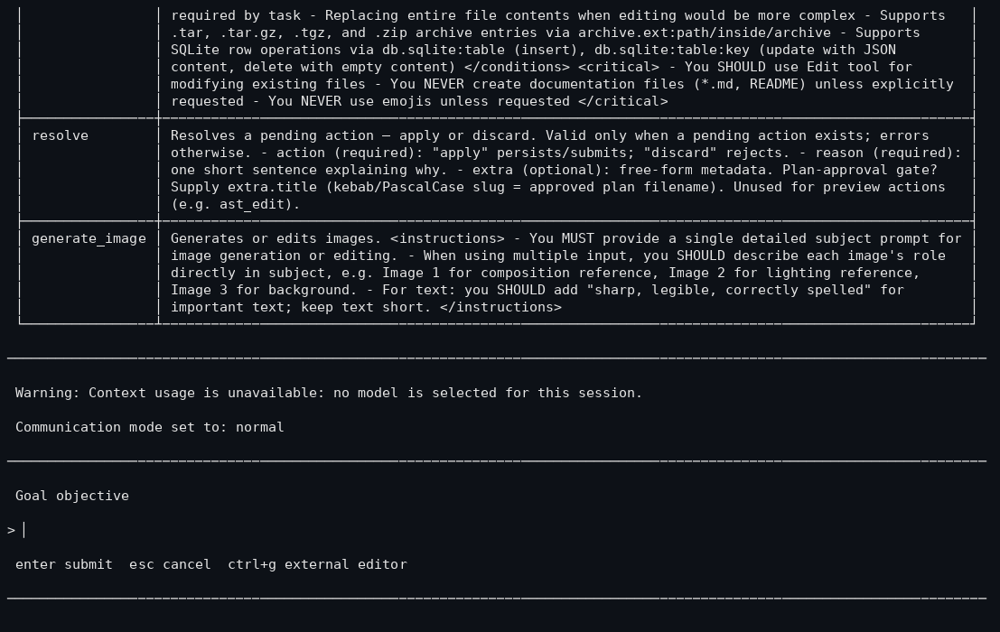

# Mode Goal

## Tujuan

Objektif otonom yang persisten untuk sebuah sesi. Saat goal aktif, agen mengarahkan turn-nya sendiri menuju objektif (dengan budget token dan accounting wall-clock) alih-alih menunggu instruksi langkah demi langkah.

## Cara kerjanya

- `/goal set <objective>` memulai mode dan mencatat goal; runtime (`src/goals/runtime.ts`) melacak penggunaan per-turn dan wall-clock.
- Setiap turn, runtime goal menyuntikkan prompt steering (`goal-mode-active.md`) agar model menjaga objektif; saat budget token rendah ia beralih ke `goal-budget-limit.md`; saat melanjutkan ia memakai `goal-continuation.md`.
- State disimpan oleh host (`persist(mode)` → `goal` / `goal_paused` / `none`), jadi goal yang dijeda bertahan saat restart.
- Subcommand: `set`, `show`, `pause`, `resume`, `drop`, `budget` (lihat entri `goal` di `src/slash-commands/builtin-registry.ts`).

## Konfigurasi

```yaml
goal:
  enabled: true            # sakelar master (default skema: true)
  statusInFooter: true     # tampilkan state goal di footer TUI
  continuationModes: [...] # mode prompt untuk steering kelanjutan
```

Key skema: `goal.enabled`, `goal.statusInFooter`, `goal.continuationModes` (`src/config/settings-schema.ts`).

## Contoh nyata

```text
> /goal set implement --dry-run flag for the backup command and verify it
> (agen terus bekerja lintas turn, mengarahkan dirinya ke objektif)
> /goal status / /goal show        # periksa goal saat ini + budget
> /goal pause                      # tunda tanpa kehilangan objektif
> /goal resume
> /goal drop                       # akhiri objektif
```

## Perilaku yang diharapkan

- Dengan `goal.enabled: true`, goal yang di-set mengubah prompt sistem/steering yang disuntikkan agar model menjaga fokus lintas turn.
- Accounting budget token mencatat penggunaan per turn dan dapat memicu prompt steering budget-limit saat habis.
- `persist` menulis mode + state sehingga goal yang dijeda dapat dilanjutkan di peluncuran berikutnya.

## Perilaku kegagalan

- Plan mode dan goal mode bentrok: plan mode melaporkan "blocked by goal mode" saat goal mode aktif.
- Goal mode di-scope sesi; proses mati kehilangan state goal di memori kecuali disimpan host.

## Batasan

- Steering budget berbasis prompt, bukan kill-switch keras; model masih bisa sedikit melampaui sebelum prompt budget-limit berlaku.
- Tidak ada kepemilikan goal multi-sesi: goal tinggal di sesi yang menetapkannya.

## Screenshot



`/goal show` dengan objektif aktif; footer menampilkan indikator Goal dan budget token.

## Status pengujian

**PARTIAL** - diimplementasikan (`src/goals/` + wiring registry) dengan test penggunaan token di permukaan unit runtime; belum ada test lifecycle goal end-to-end dengan turn agen nyata yang di-commit. Bukti: `src/goals/*` dan entri registry `goal` dengan subcommand `set/show/pause/resume/drop`.
