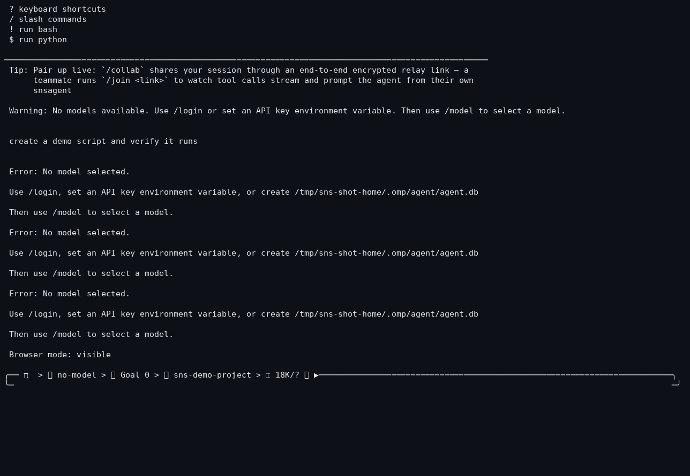

# Browser Automation

## Purpose

Let the agent drive a real browser — navigate, click, fill forms, extract
content, take screenshots — for sites and web apps that need more than a fetch.

## How it works

- Built on Puppeteer (`puppeteer-core` + `@puppeteer/browsers`) with stealth
  scripts (`src/puppeteer/*.txt`) to reduce bot detection.
- `src/tools/browser/` manages the lifecycle: `launch.ts` (chromium launch),
  `tab-supervisor.ts` / `tab-worker.ts` (per-tab worker processes),
  `tab-protocol.ts`, `cmux` (connection multiplexing), `aria/` (ARIA tree for
  screen-reader-style access), `readable.ts` (content extraction), `render.ts`.
- Two modes: **headless** and **visible**; `/browser` toggles between them.

## Configuration

```yaml
browser:
  enabled: true        # master toggle (schema key browser.enabled)
  headless: true       # true = headless, false = visible window
  cmux: ...            # connection multiplexing option
  screenshotDir: ...   # where screenshots are saved
```

## Real example

```text
> open example.com and screenshot the hero section
> (agent launches chromium, navigates, captures docs/screenshots/...)
> /browser            # switch headless ⭄ visible
```

## Screenshot



`/browser` reports the active mode (headless or visible) in the TUI — captured
in a sandboxed, anonymized workspace from the current build.

## Failure behavior

- Without a Chromium install, launch fails with a clear error; the tool
  surfaces it instead of crashing the session.
- Tab workers are supervised — a crashed tab is restarted or reported rather
  than killing the whole browser.

## Limitations

- Requires a Chromium binary; first launch may need `npx puppeteer browsers
  install chrome`.
- Heavier than plain HTTP fetch; use for interactions, not bulk scraping.
- Stealth helpers reduce detection but are not guaranteed undetectable.

## Testing status

**PARTIAL** — implemented (`src/tools/browser/`, ~15 files) with the mode
toggle (`browser.headless`) verified; no committed end-to-end browser test that
drives a real page. Evidence: `src/tools/browser/*` + registry `browser` entry.