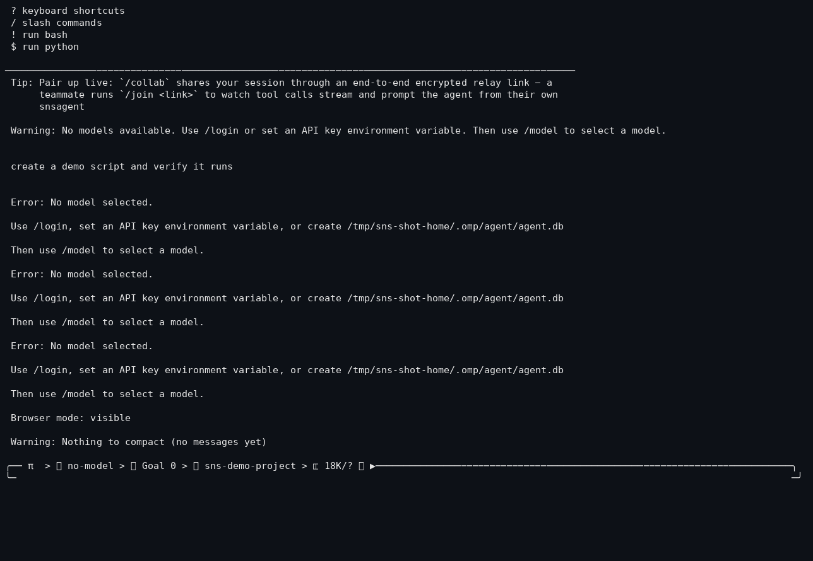

# Context Compaction

## Purpose

Shrink a long conversation before it overflows the model's context window,
keeping a working summary instead of losing the thread.

## How it works

- `src/session/` (agent-session + compact-modes) runs compaction at
  `compaction.thresholdPercent` / `thresholdTokens` of the window, or
  manually via `/compact`.
- Three modes (`src/session/compact-modes.ts`):
  - `soft` — summarize locally with the active model (skip remote endpoints).
  - `remote` — summarize via the remote endpoint / provider-native compaction.
  - `snapcompact` — archive history onto dense bitmap images the model reads
    back (no LLM call; rejects focus text).
- `/compact [mode] [focus...]` — a leading known mode is treated as the mode
  selector, otherwise the whole argument string is focus instructions
  (backward compatible).
- `compaction.strategy` selects the summary strategy (e.g. `context-full`)
  unless a mode overrides it.

## Configuration

```yaml
compaction:
  enabled: true             # schema default: true
  strategy: ...             # summary strategy (context-full, ...)
  thresholdPercent: 80      # auto-compact when context hits 80%
  thresholdTokens: ...      # or when token count hits this
  remoteEnabled: ...        # allow provider-side compaction
  reserveTokens: 16384      # tokens to keep free during compaction
  keepRecentTokens: 20000   # most-recent tokens kept verbatim
  autoContinue: true        # continue the turn after compaction
  handoffSaveToDisk: ...    # persist pre-compaction history
```

## Real example

```text
> /compact                        # summarize locally, keep focus
> /compact soft focus on the TBM integration
> /compact remote                # provider-native compaction
> /compact snapcompact           # bitmap archive, no LLM call
```

## Screenshot



`/compact` on an empty session — the honest empty-state message ("Nothing to
compact"). Captured from the current build in a sandboxed, anonymized workspace.

## Failure behavior

- A mode that demands a remote path (`requiresRemote`) with no remote endpoint
  set warns and falls back to a local summary.
- `snapcompact` with focus text is an error (rejects focus).

## Limitations

- Summaries lose detail by design; `keepRecentTokens` protects the tail.
- Time/token measurement not end-to-end audited with a real long session.

## Testing status

**PARTIAL** — compaction strategies implemented in `src/session/` and mode
parsing covered by parse tests (`compact-modes` parse logic); no committed
full-session long-context compaction test. Evidence: `src/session/compact-modes.ts`
+ `compaction.*` schema keys.