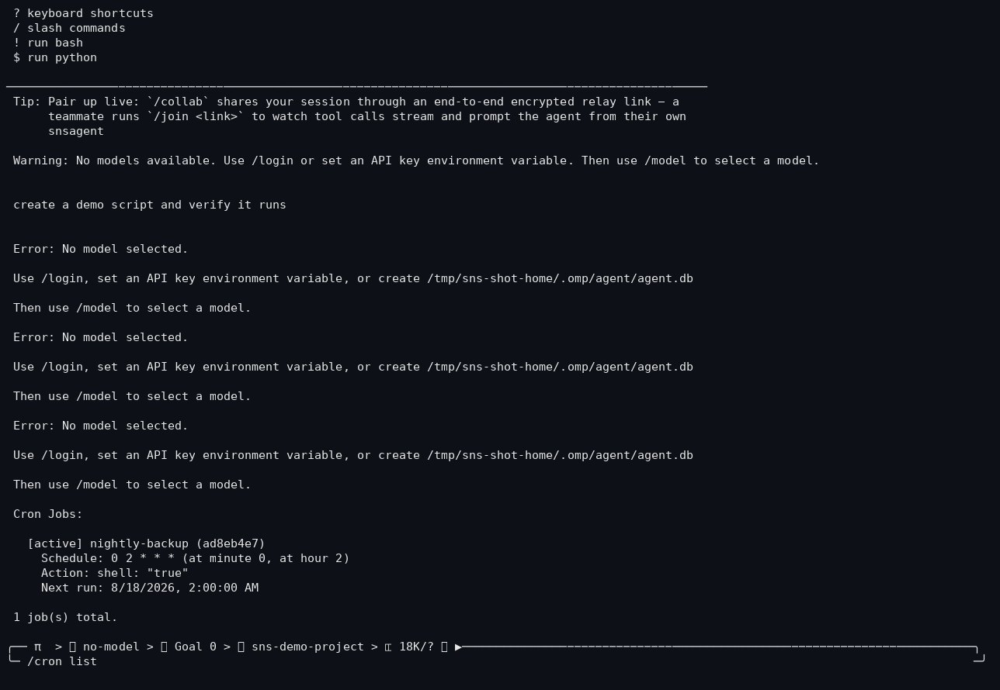

# Cron Scheduler

## Purpose

Run agent actions on a schedule — prompts, shell commands, or skills — from a
persistent SQLite-backed scheduler inside the agent process.

## How it works

- `CronScheduler` (`src/cron/cron-scheduler.ts`) ticks every 60 s (configurable
  `intervalMs`) and runs any due jobs.
- Cron expressions are standard 5-field (minute hour day-of-month month
  day-of-week); `src/cron/cron-parser.ts` provides `parseCronExpression`,
  `cronMatches`, `getNextCronRun`, `describeCron`.
- Jobs persist in SQLite via `CronStore` (`cron-store.ts`).
- Action types: `prompt` (feed a prompt to the agent), `shell` (run a
  command), `skill` (invoke a skill by name).

## Configuration

```bash
/cron list                   # List all jobs
/cron add <name> <expr> <type> <action>   # type: prompt | shell | skill
/cron remove <id>
/cron run <id>               # Run a job immediately
/cron enable | disable       # Toggle the scheduler or a job
```

## Real example

```text
> /cron add daily-backup "0 2 * * *" shell "git push --tags"
> /cron list
> /cron run daily-backup
```

## Screenshot



`/cron list` after adding a job (`nightly-backup`, `0 2 * * *`, shell action) —
from the current build in a sandboxed, anonymized workspace.

## Failure behavior

- A tick that throws logs `Cron tick error:` and the scheduler keeps going on
  the next interval (see `cron-scheduler.ts` error handling).
- Jobs whose action fails are recorded with their last-run timestamp; the
  scheduler doesn't crash the process.

## Limitations

- The scheduler runs inside the agent process only — if the agent isn't
  running, cron jobs don't fire.
- Interval granularity is 60 s; sub-minute schedules aren't supported.
- Not everything is audited with a real driver loop; the parser is covered by
  tests, the scheduler tick is not deep-audited end-to-end.

## Testing status

**PARTIAL** — `cron-parser` has unit tests; scheduler + store have no confirmed
end-to-end test. Evidence: `src/cron/__tests__/` + `src/cron/*`.